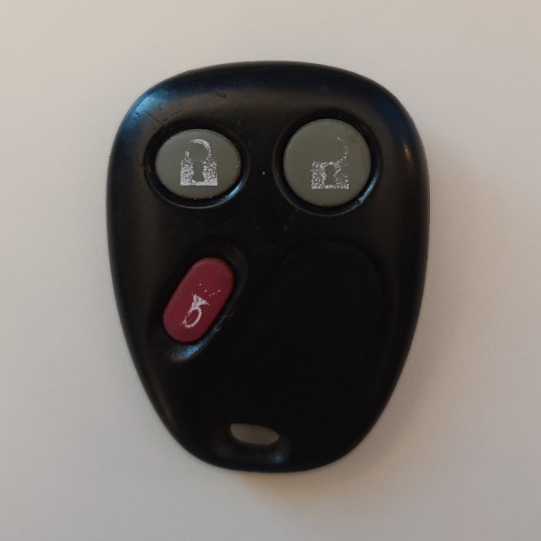
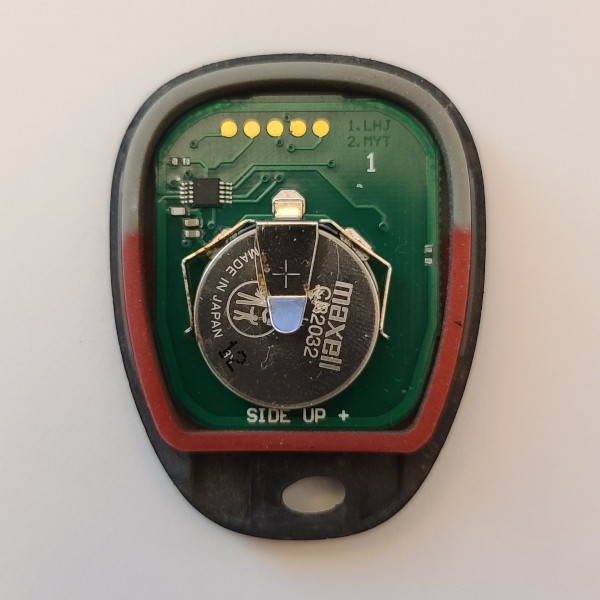
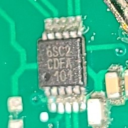

# 6SC2 - Car Remote (315 MHz)

## Manufacturer
- Unknown

## Supported Models
- 6SC2 CMGU
- 6SC2 CDFA

## Notes

The transmitter uses a rolling code message with an unencrypted sequence number.

### Button operation
This transmitter has 4 buttons which can be pressed once to transmit a single message

## Images
* Front

  

* Internal

  

* Chip

  