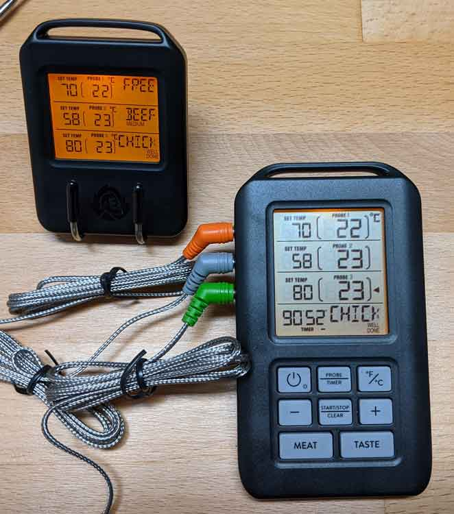
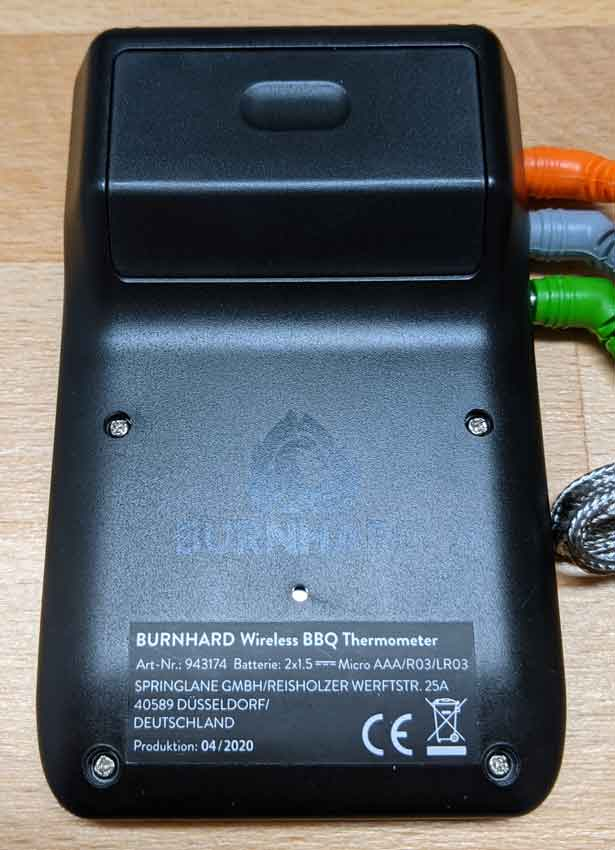
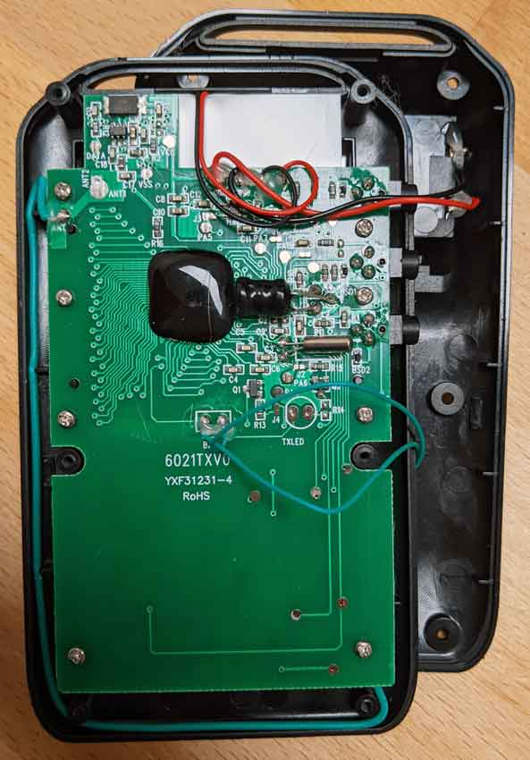

# Burnhard BBQ Thermometer

A digital BBQ thermometer sold by the company Springland under
their BBQ brand 'Burnhard'.

- [Product Information](https://www.burnhard.de/zubehoer/uebersicht/grillzubehoer/digitales-bbq-thermometer-inkl.-4-sonden-943174)
- [User Manual](https://www.burnhard.de/media/pdf/d1/75/d2/BURNHARD_IM_BBQ-Thermometer_200713_WEB.pdf)

The transmitter supports 3 temperature probes, each of the with the same
feature set:

- Current and target temperature (in Celsius or Fahrenheit).
- A meat and taste type for quick selecting the target temperature.
- A timer / or elapsed time.
- An alarm.
