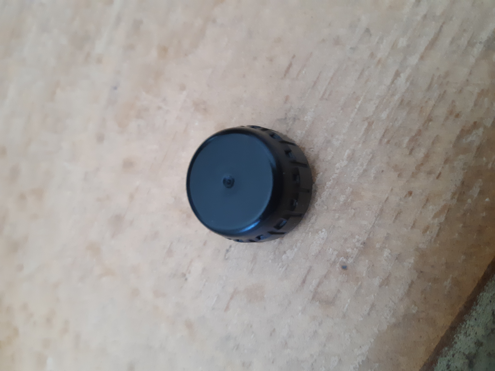
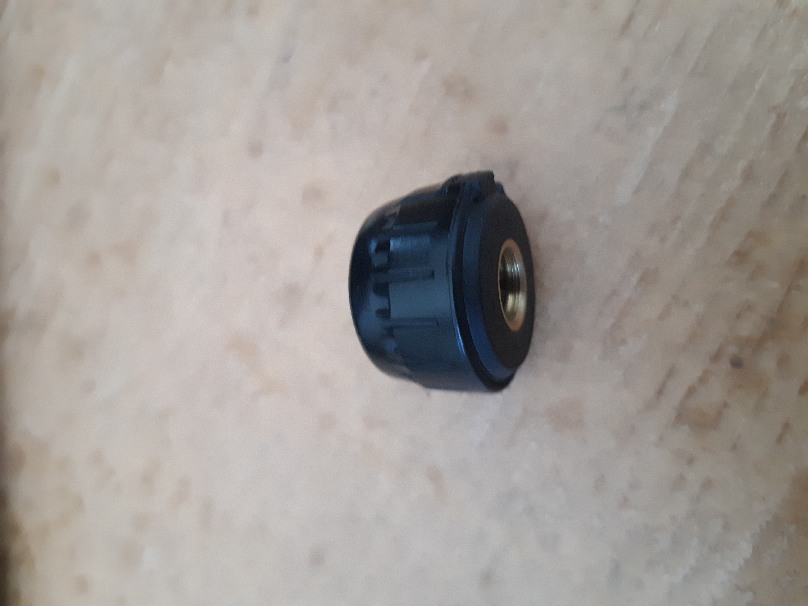
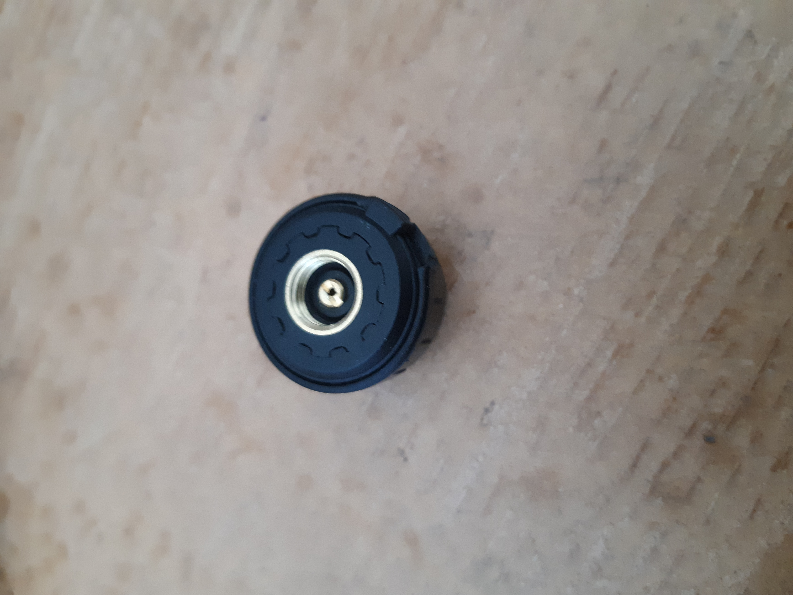

# CAREID U901-T TPMS

Found this kit (TPMS sensors with a reader) out of China, intended for Big Rig Trucks. When trying to read, the protocol wasn't detected.

The included files were read with one sensor attached to a bycicle tire, while being deflated (starting at around 30 PSI).

The company website doesn't list this unit: http://careud.com
The unit can be found on Amazon (among other places): https://amazon.com/Pressure-Monitoring-Careud-External-Temperature/dp/B076ZNWGSG

I have been able to confirm these broadcast on 433Mhz (both through this tool and others). I haven't been able to find the FID.

Format: 

Format: 

Format: 

