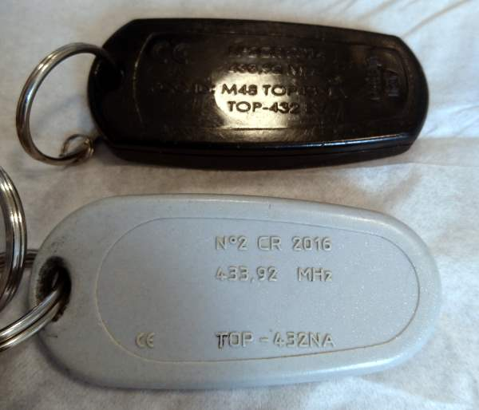
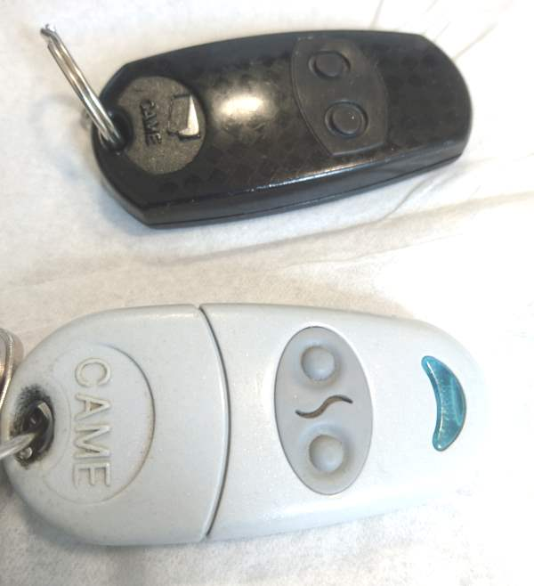

# CAME Garage door key - TOP432

Compatible with key TOP-432EV, TOP-432NA, TOP-432EE.

This remote control is used for garage door and sliding gate. It transmits on 433.92 MHz (as it is written on the case), built since 2006.

It works with CAME radio receiver cards "AF43S", capable of handling 4096 codes. CAME is an italian company. Theses remote controls are mainly sold in europ (France, Italy, Belgium). https://www.came.com and https://www.came-europe.com .


FCC ID is "M48 TOP43XEV" but I could not find this exact reference on fcc.gov search engine, but I found an approaching one under reference "M48TOP-NA". It says "Transmitter 433,92 MHz in AM/ASK" . So a decoder should be easily writable for rtl_433 .

Here is attached some pictures of the device and two CU8 samples signals (from the two buttons of the remote control).
 

By anaylizing the two signals with `rtl_433 -A -r Button1_433.83M_250k.cu8` we can see the signal is simple. With the help of a russian site (http://phreakerclub.com/447), we guess the folloing information :
- there is two pulse and gap lengts : short is 320us, long is 640us
- there is a start pulse of 320us
- the start pulse is followed by 12 bits
- a 0 bit is a short gap (320us) followed by a long pulse (640us)
- a 1 bit is a long gap (640us) followed by a short pulse (320us)
- the message is repeated 4 times
- there is 36 period of 320us between messages (11520us)
- no CRC, no parity check, no premable.

A flex decoder can be written like this :
```
$> ./rtl_433 -r Button2_433.83M_250k.cu8 -X "n=CameTOP,m=OOK_PPM,s=320,l=640,r=10000,unique"
(...)
data      : 78c
$> ./rtl_433 -r Button1_433.83M_250k.cu8 -X "n=CameTOP,m=OOK_PPM,s=320,l=640,r=10000,unique"
(...)
data      : b8c
```

Because there is no CRC, the software decoder is not activated by default. To use it, you have to register the decoder when starting rtl_433 :
```
$> ./rtl_433 -R 164 -r Button1_433.83M_250k.cu8
(...)
time      : @0.436348s   brand     : CAME
model     : TOP432       type      : remote control code      : 1139         code_hex  : 473
```

If you want to brute force all the combination of a code :
- 12 bits x (320+640) = 11 520us
- + the 11520 pause between each msg = 23 040us
- + send 4 times the message = 92 160us
- + send it 4096 times = 377 487 360us
- so it could take up to 6 minutes to test all the code
- but some optimisation are possible : receive accept pulse/gap of 300ms, and by using the De Bruijn sequence of 1972 bits, this time can be reduced to a few seconds (same principle as https://samy.pl/opensesame/)

