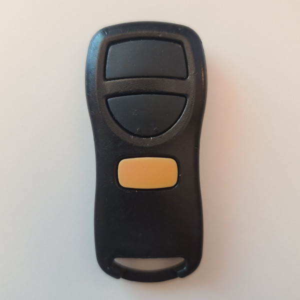
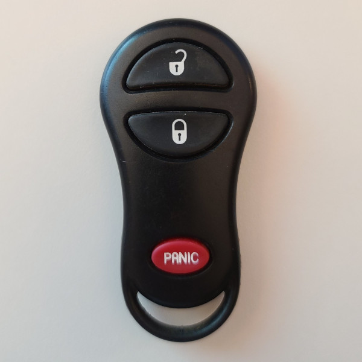
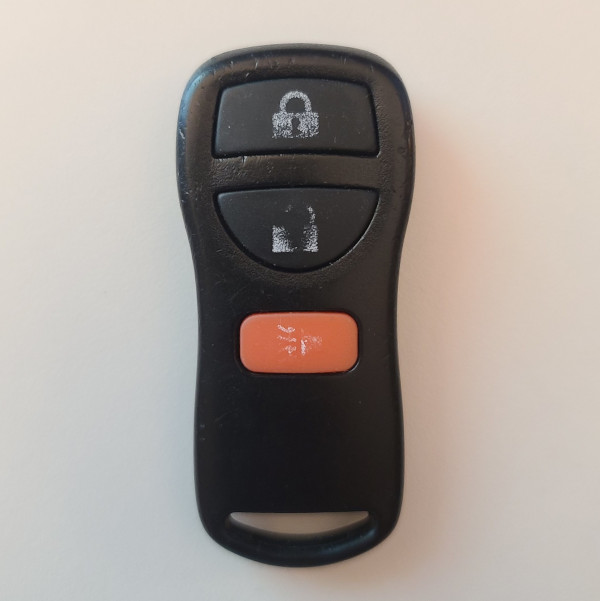
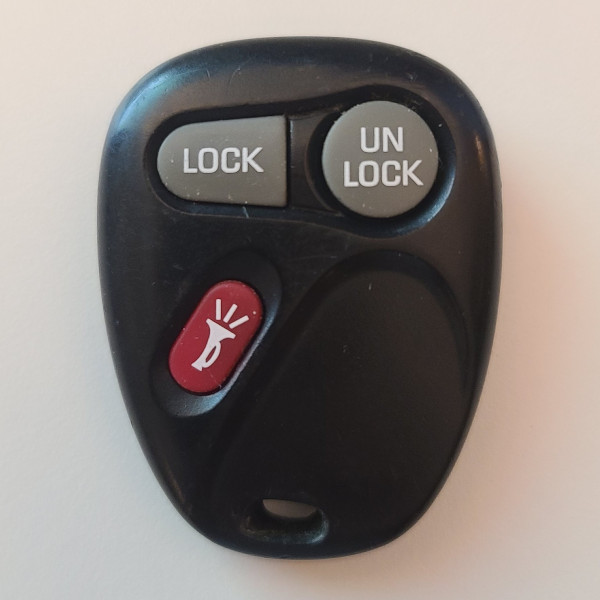

# Microchip HCS361 KeeLoq Code Hopping Encoder based remotes

## Manufacturer
- Microchip

## Supported Models
- Leer - OUTE_ELC (FCC ID KOBLEAR1XT)
- Marelli - (FCC ID KBRASTU15)
- Jeep / Chrysler remote
- Any other devices using HCS361

## Notes

66 bits transmitted, LSB first.

Extended Serial Number Disabled:

```
|  0-31 | Encrypted Portion
| 32-59 | Serial Number
| 60-63 | Button Status (S3, S0, S1, S2)
|  64   | Battery Low
| 65-66 | CRC
```

Extended Serial Number Enabled (does not include button codes):
```
|  0-31 | Encrypted Portion
| 32-63 | Serial Number
|  64   | Battery Low
| 65-66 | CRC
```
Note that the button bits are (MSB/first sent to LSB) S3, S0, S1, S2.
Hardware buttons might map to different combinations of these bits.

- [Datasheet](40146F.pdf)


## Images
* Front - Example 1

  

* Front - Example 2

  

* Front - Example 3

  

* Front - Example 4

  