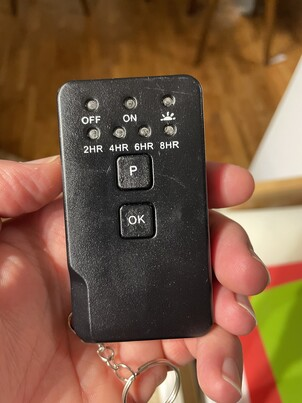
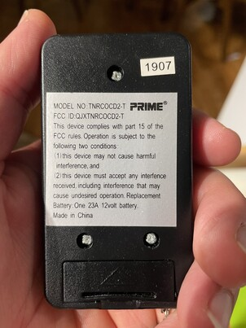
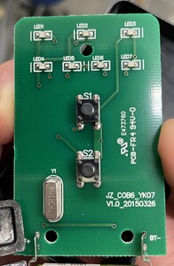
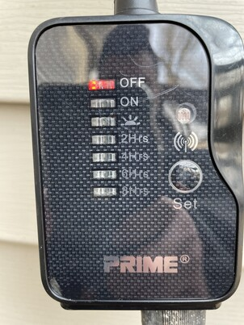
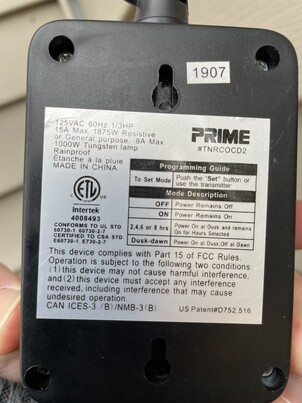

# Prime Wire and Cable TNRCOCD2 remote controlled countdown timer. 

A remote controlled countdown timer.  May be used indoors or outdoors.  Remote sets the timed function.  Timer begins once
dusk is sensed by the photo eye on the switch.

May be obsolete.  May have been superceeded by TNRCOCD2-RC2.  Still listed in Prime Wire and Cable catalog, page 13.

https://cdn.shopify.com/s/files/1/0007/9029/8742/files/Prime_Catalog_2021-2022-2.pdf?v=1646943680

FCC ID : QJXTNRCOCD2-T
https://apps.fcc.gov/oetcf/eas/reports/ViewExhibitReport.cfm?mode=Sum&calledFromFrame=Y&RequestTimeout=500&application_id=vgaB0jItwyAbfpvydNN7Xw%3D%3D&fcc_id=QJXTNRCOCD2-T

Manual: https://www.manualslib.com/manual/2419814/Prime-Wire-And-Cable-Tnrcocd2.html

Timer may be set at the switch or the remote and has the following settings:
- 2 hour: Circuit turns on at dusk and remains on for 2 hours.
- 4 hour: Circuit turns on at dusk and remains on for 4 hours.
- 6 hour: Circuit turns on at dusk and remains on for 6 hours.
- 8 hour: Circuit turns on at dusk and remains on for 8 hours.
- On: Turns circuit on and it remains on until turned off manually.
- Off: Turns circuit off.
- Sun symbol (dusk to dawn): Circuit turns on at dusk and turns off at dawn.
