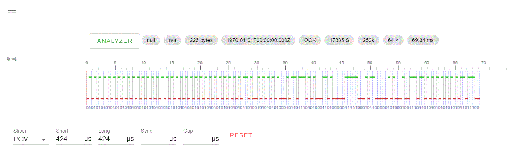

# TFA Marbella Pool thermometer

TFA Marbella is a wireless pool termomenter with main a display.

Sensor cat no:       30.3238.06

Main display cat no: 3066.01

External links

https://www.tfa-dostmann.de/produkt/funk-poolthermometer-marbella-30-3066/

https://clientmedia.trade-server.net/1768_tfadost/media/3/52/21352.pdf


Radio encoding
==============
The Marbella sensor operates at 868MHz frequency band.
Using rtl_433 with -A option indicates:
...
 FSK_PCM with s=424,l=424 and r=434176
...



Data encoding
=============

Using rtl_443 on the recorded files with option -A gave the following files and temperatures
```
5555555555555555695516ea341f8b0513a555358 [g001: 22.8]
5555555555555555695516ea341f8b0613a555310 [g002: 22.8]
5555555555555555695516ea341f8b0713a555328 [g003: 22.8]
5555555555555555695516ea341f8b0013a555380 [g004: 22.8]
5555555555555555695516ea341f8b071c6d551e8 [g005: 59.0]
5555555555555555695516ea341f8b001c0555760 [g006: 49.6]
5555555555555555695516ea341f8b011b4d55288 [g007: 47.3]
5555555555555555695516ea341f8b021a9555018 [g008: 45.0]
5555555555555555695516ea341f8b0319ed555c8 [g009: 42.9]
5555555555555555695516ea341f8b04194d55318 [g010: 40.9]
5555555555555555695516ea341f8b0518cd55570 [g011: 39.3]
5555555555555555695516ea341f8b01142555630 [g017: 24.6]
5555555555555555695516ea341f8b000f6d557a0 [g022: 9.3]
5555555555555555695516ea341f8b010f3d55060 [g023: 8.7]
```
Using BitBench to analyse the bitstream resulted in: 

```
PRE: hhhhhhhhhhhhhhhh ID: bhhhhhhhh SERIAL: hhhhhh ZO: h CTR: 3d  TEMP: 16d POST: hhb CHK:d  END: bbb

(Bitbench notation)

PRE:    Premble 0x55
ID:     ID of to indicate TFA Marbella ? (Static even afer a reset)
SERIAL: ID of the devices: Is printed on the device, se picture below
Z0:     unknown (always zero)
CTR:    3 bits counter, +1 for each transmission
TEMP:   The temperature in 2 bytes. Temp in degree celsius is TEMP * 0,0125 - 40,0625 
POST:   always 0x55 0
CHK:    probably checksum. Needs to be invastigated further.
END:    always "000"

```


