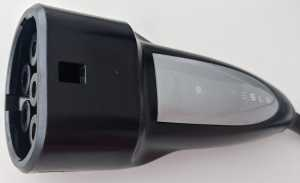

# Tesla charge port opener

```rtl_433 -r pressbutton__433.92M_250k.cu8 -X "n=Tesla charge port opener,m=OOK_MC_ZEROBIT,s=400,r=1200,t=20```

* r=1200 and t=20 are minimum values confirmed to work with this hardware, but larger values should be used for tolerance.

```
time      : @0.179084s
model     : Tesla charge port opener               count     : 2             num_rows  : 2             rows      :
len       : 1            data      : 0,
len       : 1            data      : 0
codes     : {1}0, {1}0
_ _ _ _ _ _ _ _ _ _ _ _ _ _ _ _ _ _ _ _ _ _ _ _ _ _ _ _ _ _ _ _ _ _ _ _ _ _ _ _ _ _ _ _ _ _ _ _ _ _ _ _ _ _ _ _ _ _ _ _ _ _ _ _ _ _ _ _ _ _ _ _ _ _ _ _ _ _ _ _ _ _ _ _ _ _ _ _ _ _ _ _ _ _ _ _ _ _ _ _ _ _ _
time      : @0.203604s
model     : Tesla charge port opener               count     : 5             num_rows  : 5             rows      :
len       : 13           data      : 0000,
len       : 52           data      : 094aa9b38da19,
len       : 52           data      : 094aa9b38da19,
len       : 51           data      : 094aa9b38da18,
len       : 1            data      : 0
codes     : {13}0000, {52}094aa9b38da19, {52}094aa9b38da19, {51}094aa9b38da18, {1}0
_ _ _ _ _ _ _ _ _ _ _ _ _ _ _ _ _ _ _ _ _ _ _ _ _ _ _ _ _ _ _ _ _ _ _ _ _ _ _ _ _ _ _ _ _ _ _ _ _ _ _ _ _ _ _ _ _ _ _ _ _ _ _ _ _ _ _ _ _ _ _ _ _ _ _ _ _ _ _ _ _ _ _ _ _ _ _ _ _ _ _ _ _ _ _ _ _ _ _ _ _ _ _
time      : @0.361736s
model     : Tesla charge port opener               count     : 5             num_rows  : 5             rows      :
len       : 13           data      : 0000,
len       : 52           data      : 094aa9b38da19,
len       : 52           data      : 094aa9b38da19,
len       : 51           data      : 094aa9b38da18,
len       : 1            data      : 0
codes     : {13}0000, {52}094aa9b38da19, {52}094aa9b38da19, {51}094aa9b38da18, {1}0

(...) the 2 two decoded identical signals are repeated for a total of 10 times, including the above 2.

```

* The relevant signal is repeated 10 times, while there is in fact a different and unique leading signal. This might be nuisance on circuit start.
* There are no unique codes or transmissions variants. The code is the same for all Tesla charge port handles and there is a single button.
* The transmitter hardware is reported to be using a Si4010.

## Pictures


