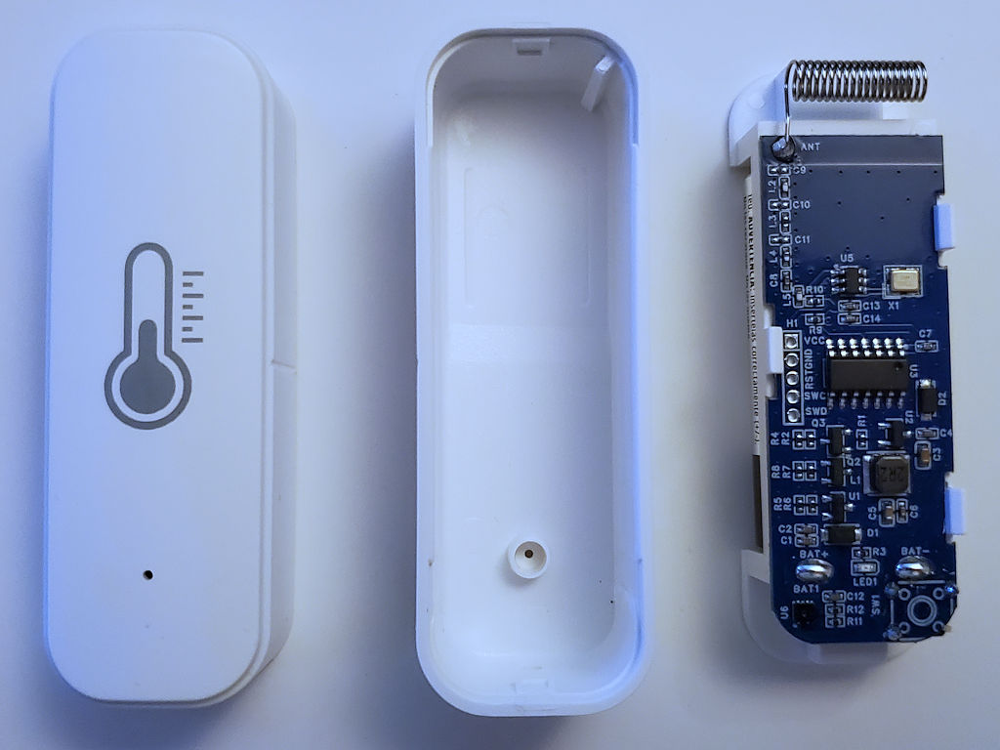
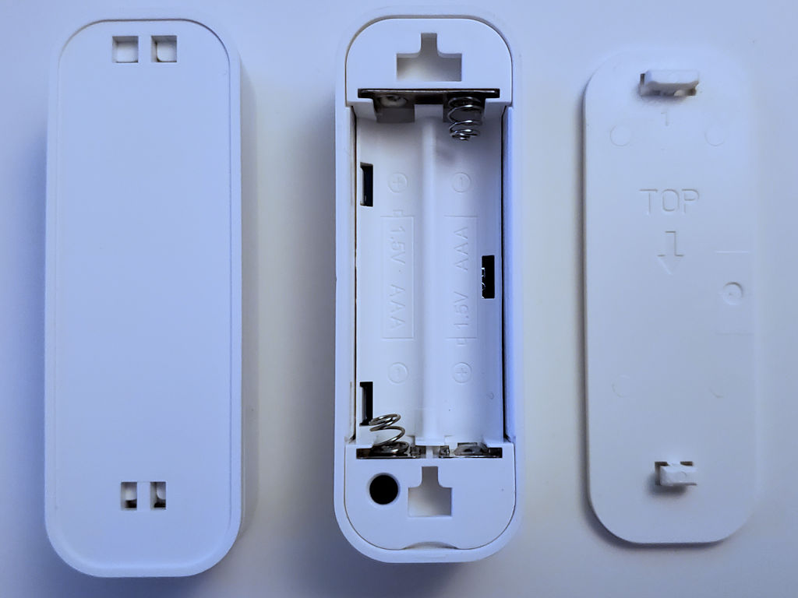
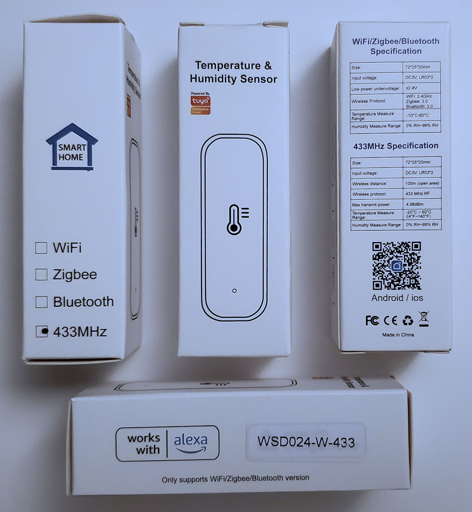
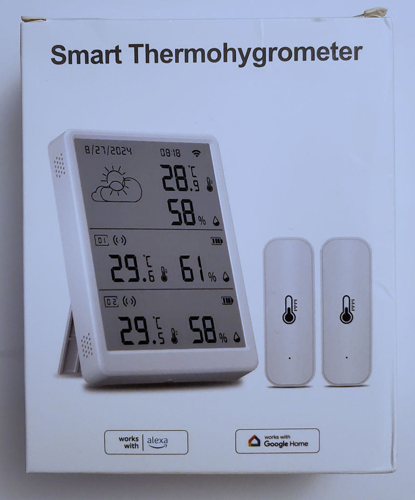

# Tuya WSD024-W-433

These sensors are part of the "Tuya WiFi Weather Station" sold on [AliExpress](https://www.aliexpress.us/item/3256808493034721.html) (product ID: WSD023-WIF-433-W12) by the seller [SMATRUL](https://smatruldoorbell.aliexpress.com/store/1101261049).

__Note:__ When asked for details about these sensors, a Tuya support person suggested that while Tuya components are used in this product, Tuya may not be the actual manufacturer.

The sensors operate on 433.92 MHz and the base station acts as a hub connected to the internet via Wi-Fi.
Pairing sensors to the base station requires an internet connection and use of the SmartLife mobile app, but the sensors operate the same whether they have been paired or not.

The sensors are powered by two AAA batteries.
A red LED on the front lights up during transmissions.
Underneath the cover on the back there is a pairing button, causing the sensor to send 13 transmissions about 400 ms apart.
A pairing bit is set for these transmissions.

In normal operation these sensors take a measurement every 10s, but only transmit an update when there has been a sufficient change in the measurements.
According to an image in the product description this should happen when the temperature changed by 0.2°C or when the humidity changed by 2%, but observation suggests the actual required minimum changes are 0.3°C and 3% instead.
The sensors also appear to be transmitting after 5m 10s when there has not been a sufficient change in the measurements.
The cloud API ignores readings below -20°C or above 60°C, but the base station will still try to display them.

The battery level is reported in 1% increments, but measurements of the battery level seem much less frequent.
Re-inserting the batteries also doesn't necessarily produce the same reading each time and sometimes differs a lot from previous readings.
The sensor reports a battery percentage of 100% for 3.0V and 0% for 2.3V.
Voltages above 3.0V will be reported as > 100%, with the base station even accepting readings of 255% (8-bit limit), though the cloud API and mobile app will report at most 100%.
The mobile app will show a notification when the reported battery level drops below 20%.

## Test Files

The provided recordings are artificially created using a [D-LIFE 433.92 MHz transmitter module](https://www.amazon.com/dp/B0BZRRBBNK) and recorded with rtl_433.
Note that the original transmitter shows less overshoot than these recordings.

The "Count" column reflects how many times the decoder saw identical data in the same transmission.
Because corrupted sensor IDs have been observed to not necessarily result in invalid MIC value, rtl_433 users may want to use redundancy as an additional integrity check by ignoring readings with Count = 1.

Count = - is used to document data that is in the recording, but that won't actually get reported by the decoder. See the test specific notes for details.

| Test | Files                                                                  | Sensor ID | Pairing | Cycle | Temperature | Humidity | Battery | Count |
| ---- | ---------------------------------------------------------------------- | --------- | ------- | ----- | ----------- | -------- | ------- | ----- |
|    1 | [CU8](01/test_1_433.92M_250k.cu8), [JSON](01/test_1_433.92M_250k.json) | AB3456    | No      |     0 |      12.3°C |      45% |     67% |     5 |
|    2 | [CU8](01/test_2_433.92M_250k.cu8), [JSON](01/test_2_433.92M_250k.json) | AB3456    | Yes     |    43 |     -12.3°C |      12% |    245% |     5 |
|    3 | [CU8](01/test_3_433.92M_250k.cu8), [JSON](01/test_3_433.92M_250k.json) | F9E8D7    | No      |   100 |       0.0°C |      99% |    100% |     3 |
|    4 | [CU8](01/test_4_433.92M_250k.cu8), [JSON](01/test_4_433.92M_250k.json) | F9E8D7    | No      |    17 |      33.0°C |      50% |    100% |     5 |
|    5 | [CU8](01/test_5_433.92M_250k.cu8), [JSON](01/test_5_433.92M_250k.json) | D83976    | No      |    62 |      26.5°C |      20% |     19% |     1 |
|      |                                                                        | 907722    | No      |     1 |      -8.4°C |      75% |     80% |     2 |
|      |                                                                        | FA0605    | No      |    33 |       5.1°C |      89% |    109% |     2 |
|      |                                                                        | 361B68    | No      |    19 |      13.9°C |      34% |    101% |     1 |
|      |                                                                        | AC8174    | No      |    50 |      34.1°C |      97% |     22% |     - |
|    6 | [CU8](01/test_6_433.92M_250k.cu8), [JSON](01/test_6_433.92M_250k.json) | D83976    | No      |    62 |     -20.1°C |      20% |     19% |     - |
|      |                                                                        | 907722    | No      |     1 |      60.1°C |      75% |     80% |     - |
|      |                                                                        | FA0605    | No      |    33 |       5.1°C |     128% |    109% |     - |
|      |                                                                        | 361B68    | No      |    19 |      13.9°C |      34% |    101% |     1 |
|      |                                                                        | AC8174    | No      |    50 |      34.1°C |      97% |     22% |     - |

__Test 1 & Test 2:__
Basic tests with positive and negative temperatures, pairing mode on and off.

__Test 3:__
The second and fifth row (excluding the preamble) have a flipped bit such that the MIC value is invalid, resulting in a count of 3.
In addition, this test checks handling of a situation that can arise when first powering the sensor on.
The memory used to store the counter doesn't seem to get properly initialized, possibly resulting in the counter exceeding 64 when the batteries are sufficiently charged.
The counter value of 100 in the data should get reported as 64 so that any downstream logic can rely on the counter never exceeding that value.

__Test 4:__
This test validates that the decoder can handle a potential extra bit per row.
The sensor adds an extra pulse after the preamble and each of the five instances of the payload, but it is slightly shorter than the pulse used for 0s and should normally get ignored by rtl_433.
In this test, the extra pulse in the first and fourth row (excluding the preamble) has the same length as 0s, which should lead to an extra bit in each row.
The decoder should recognize the rows with 72 and 73 bits as having the same data and report a single result with count 5.

__Test 5:__
This test contains valid data from five different sensors at the same time.
Only four should have their data reported due to an intentional limit in the decoder of four unique candidate with 72 or 73 bits.
Some of the payloads appear intact twice instead of once, and random fragments of the data are also interspersed, testing that the decoder can ignore those incomplete rows.
In addition, the first sensor has a battery level of 19%, and should get an extra battery_ok: 0 output.

Note that by default tests are run with the --first-line argument, resulting in only the first reported sensor being validated. To test the other three, edit the makefile or run the Python script manually.

__Test 6:__
This test contains a single valid row from five different sensors at the same time.
However, the first three have implausible data (temperature too high or low, humidity too high) and will not get reported.
The fourth sensor will get reported.
Because the number of candidates is limited to four, the fifth sensor will not get reported.

## Photos

