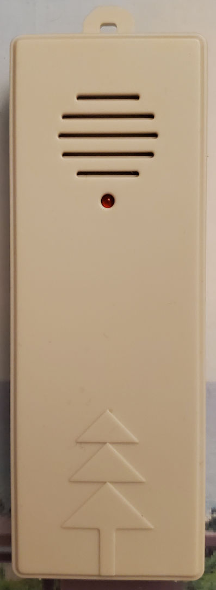
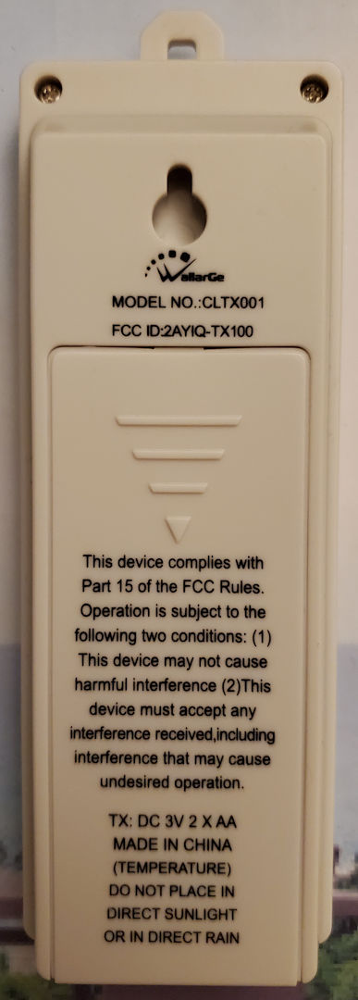
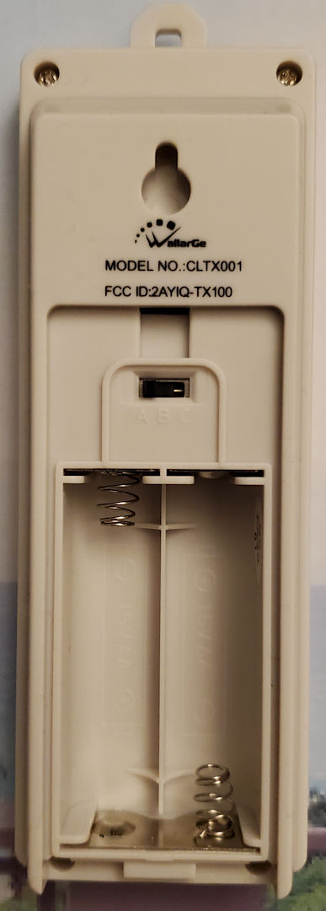
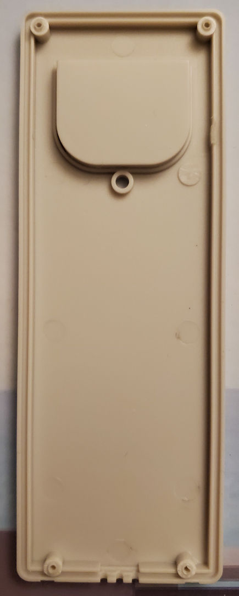
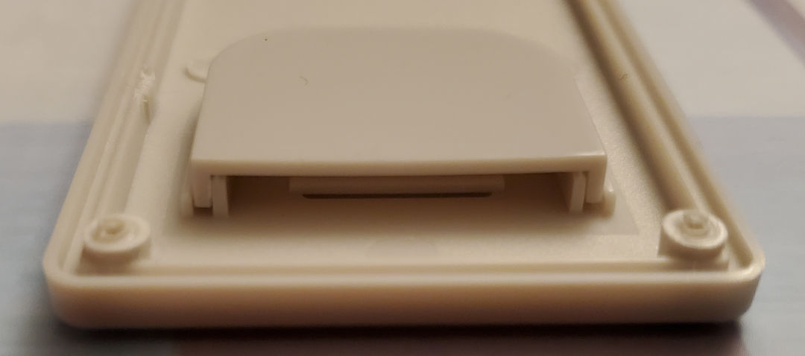
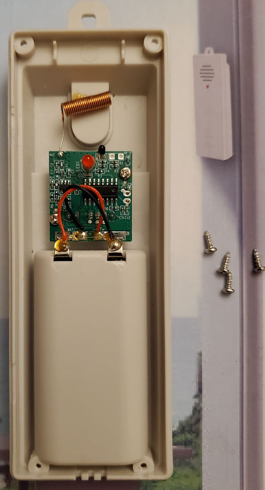
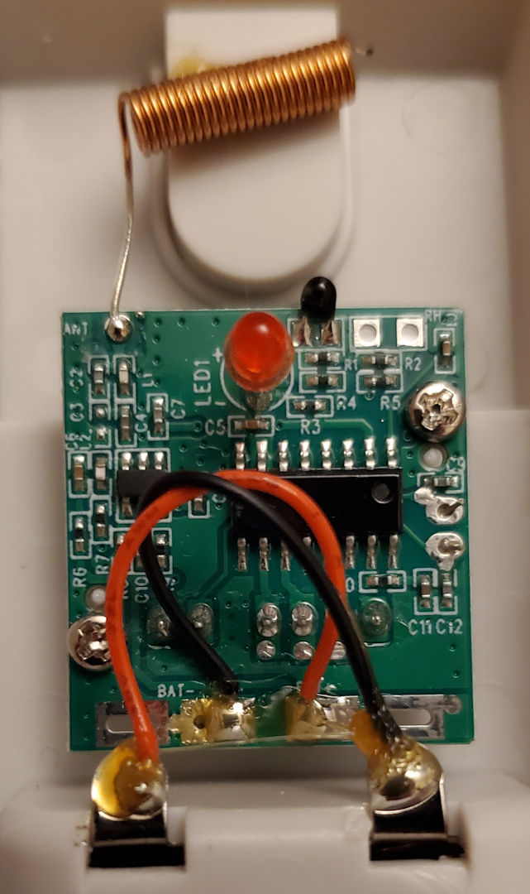
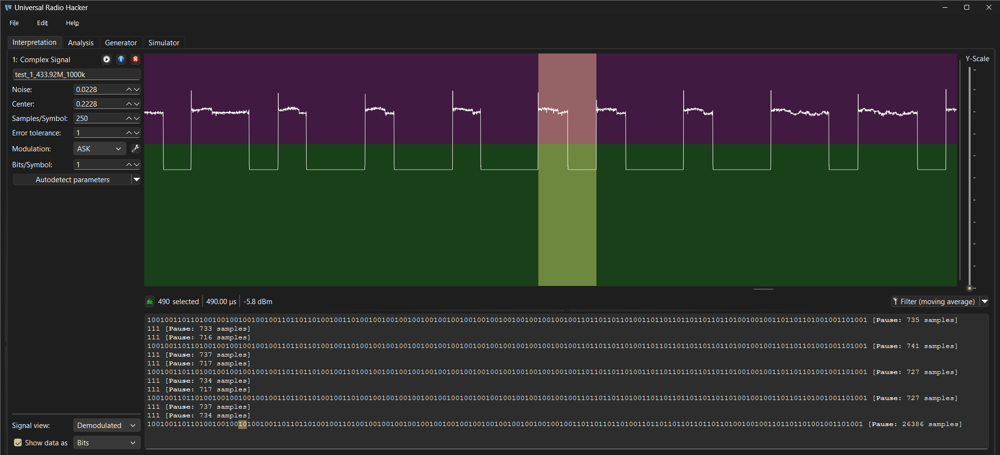
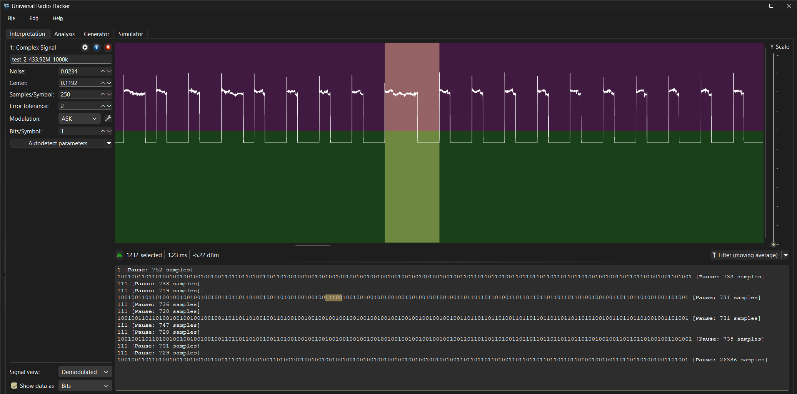
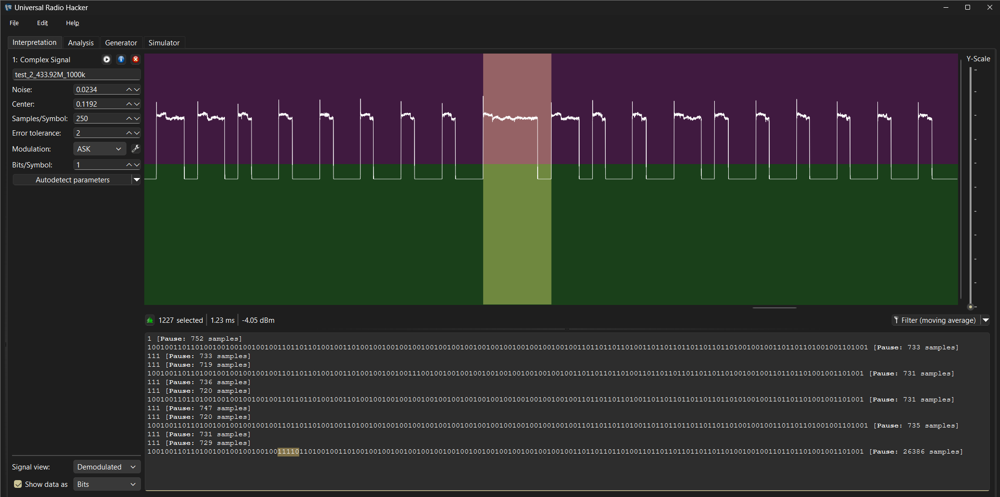

# WallarGe CLTX001 (Outdoor Temperature Sensor)

FCC ID: [2AYIQ-TX100](https://fcc.report/FCC-ID/2AYIQ-TX100)

Can be purchased individually ([Amazon.com](https://www.amazon.com/dp/B0CB17H77R/))
or bundled with WallarGe clocks like the CL6007 ([Amazon.com](https://www.amazon.com/dp/B0D9BNSQCS))
and CL7001 ([Amazon.com](https://www.amazon.com/dp/B0BYNJW532), [US-WallarGe.com](http://www.us-wallarge.com/item/3015.html)).

## Test Files

The provided recordings are faithful recreations of the kind of signals the CLTX001 transmits, emitted using a [D-LIFE 433.92 MHz transmitter module](https://www.amazon.com/dp/B0BZRRBBNK) and recorded with rtl_433. Both the CL6007 and CL7001 clocks interpret these signals as expected. Note that the original transmitter shows less overshoot and has a cleaner waveform than these recordings.

| Test | Files                                                                    | Sensor ID | Channel | Temperature | Low Battery | Test Mode |
| ---- | ------------------------------------------------------------------------ | --------- | ------- | ----------- | ----------- | --------- |
|    1 | [CU8](01/test_1_433.92M_1000k.cu8), [JSON](01/test_1_433.92M_1000k.json) |     12345 | A       |      12.3°C |             |           |
|    2 | [CU8](01/test_2_433.92M_1000k.cu8), [JSON](01/test_2_433.92M_1000k.json) |     12345 | A       |      12.3°C |             |           |
|    3 | [CU8](01/test_3_433.92M_1000k.cu8), [JSON](01/test_3_433.92M_1000k.json) |     12345 | B       |     -12.3°C | Yes         |           |
|    4 | [CU8](01/test_4_433.92M_1000k.cu8), [JSON](01/test_4_433.92M_1000k.json) |     54321 | C       |       0.0°C |             | Yes       |

**Test 1:** The kind of signal sent right after changing the channel on the sensor, including a recreation of [a bug](#bugs) in the transmitter. 
The pulse in the preamble is too short for rtl_433 and therefore has no effect. The last bit in the payload being 0 creates an additional gap that exceeds the gap limit of 650 µs, resulting in a second empty row between rows with data.

**Test 2:** Same as test 1, but matching the kind of signal sent periodically, including a recreation of [three bugs](#bugs) in the transmitter, causing the second and fifth transmission of the payload to be spread across two rows each. 
The pulse in the preamble is too short for rtl_433 and therefore has no effect. The last bit in the payload being 0 creates an additional gap that exceeds the gap limit of 650 µs, resulting in a second empty row between rows with data.

**Test 3:** Example with a different channel, a negative temperature and a low battery. 
The pulse in the preamble is long enough for rtl_433 to register, resulting in an extra leading row with a single bit. The last bit in the payload is a 1, resulting in only a single empty row between rows with data.

**Test 4:** Example with a different sensor ID, channel, temperature: 0°C and test mode enabled. In test mode, the clock keeps the receiver on after receiving a signal instead of conserving battery life until the next expected transmission. 
The pulse in the preamble is long enough for rtl_433 to register, resulting in an extra leading row with a single bit. The last bit in the payload is a 1, resulting in only a single empty row between rows with data.

## Photos

## Bugs

The CLTX001 sensor has been observed to skip ahead at times by 250 µs and even flip bits, especially when transmitting periodically instead of after changing the channel. Three such instances are highlighted below using [Universal Radio Hacker](https://github.com/jopohl/urh).

When looking at the recordings with Universal Radio Hacker, make sure the sample rate is set to 1M (Blue "i" icon). Set Samples/Symbol to 250 and Pause Threshold to 2 (wrench icon next to the Modulation dropdown menu). 

Generally, 110 = 1 and 100 = 0 for this protocol, but due to the long=0 and short=1 convention, rtl_433 interprets these as 110 = 0 and 100 = 1, requiring inversion of the data before decoding it in rtl_433.

### Example 1
Instead of 100, we see 10. Luckily, the PWM slicer in rtl_433 does not care too much about the length of gaps as long as they don't exceed the gap limit.

### Example 2
Instead of 100100 we see 11100, i.e. not only was a 250 µs period skipped, but the data is also incorrect. This pulse exceeds the expected high period of 500 µs, causing rtl_433 to drop both bits and split the row.

### Example 3
Instead of 110110 we see 11110. Essentially the same issue as in example 1, but resulting in there not being a gap at all. This pulse exceeds the expected high period of 500 µs, causing rtl_433 to drop both bits and split the row.

