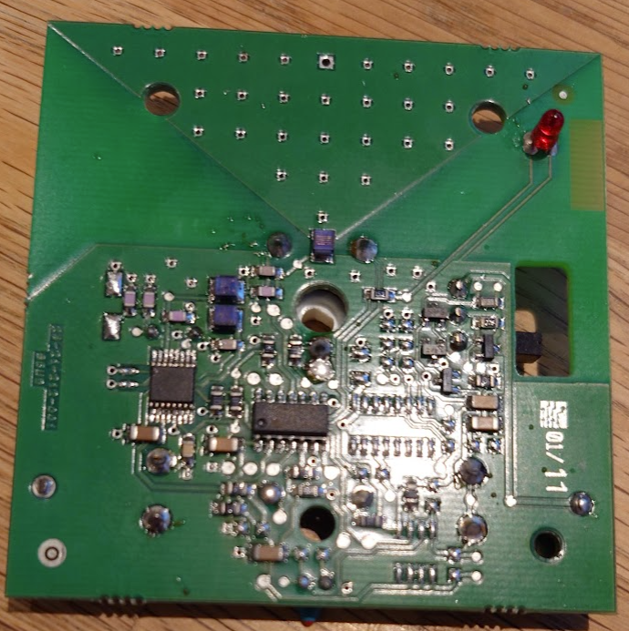
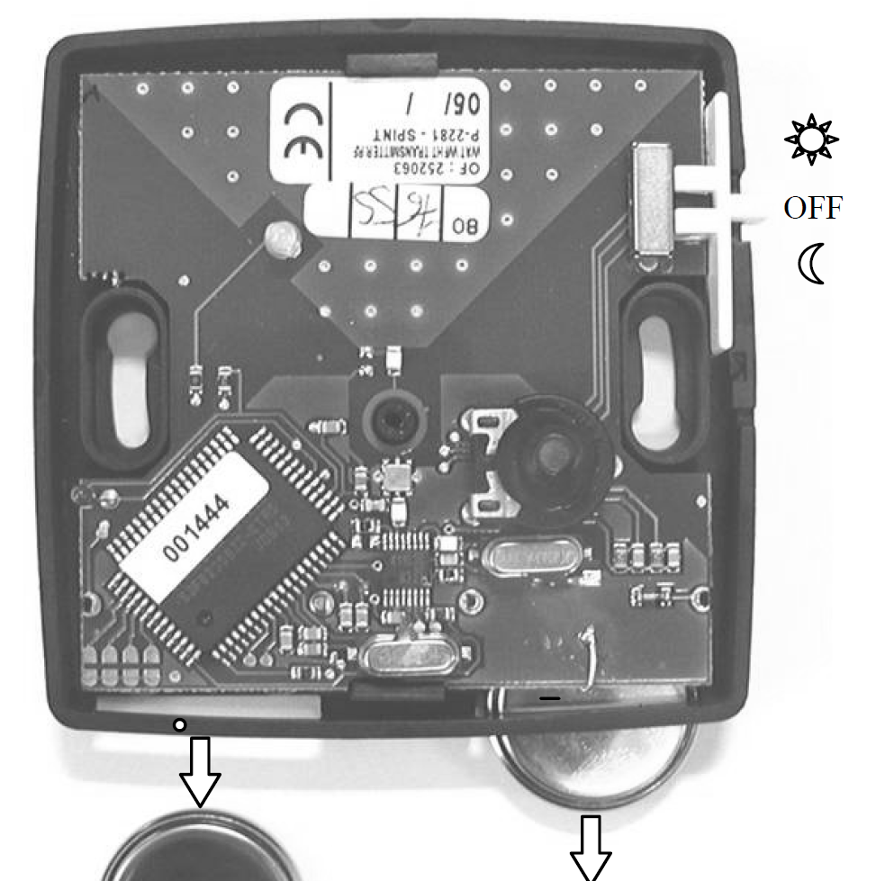
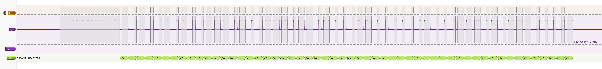

## WATTS WFHT-RF

Underfloor heating system with wireless thermostats which each have a wheel for setting temperature and a thermistor for sensing the current temp.

https://github.com/merbanan/rtl_433/issues/2230







Some pulse details:

```
2022-11-07 15:26:34,,{54}5ab249f5f79a54,WattsThermostat,1,1,
Analyzing pulses...
Total count:   55,  width: 53.24 ms             (106475 S)
Pulse width distribution:
 [ 0] count:    1,  width: 6238 us [6238;6238]  (12475 S)
 [ 1] count:   23,  width:  632 us [630;645]    (1264 S)
 [ 2] count:   31,  width:  286 us [284;296]    ( 572 S)
Gap width distribution:
 [ 0] count:   23,  width:  238 us [238;240]    ( 477 S)
 [ 1] count:   31,  width:  584 us [582;585]    (1167 S)
Pulse period distribution:
 [ 0] count:    1,  width: 6475 us [6475;6475]  (12950 S)
 [ 1] count:   17,  width: 1216 us [1214;1225]  (2431 S)
 [ 2] count:   16,  width:  525 us [524;534]    (1050 S)
 [ 3] count:   20,  width:  870 us [869;884]    (1740 S)
Pulse timing distribution:
 [ 0] count:    1,  width: 6238 us [6238;6238]  (12475 S)
 [ 1] count:   54,  width:  604 us [582;645]    (1208 S)
 [ 2] count:   54,  width:  266 us [238;296]    ( 531 S)
 [ 3] count:    1,  width: 62376 us [62376;62376]       (124751 S)
Level estimates [high, low]:   7572,    119
RSSI: -3.4 dB SNR: 18.0 dB Noise: -21.4 dB
Frequency offsets [F1, F2]:    7148,      0     (+218.1 kHz, +0.0 kHz)
Guessing modulation: Pulse Width Modulation with sync/delimiter
view at https://triq.org/pdv/#AAB104185D025C0109F3A78291A291A1A291A291A291A1A29291A29291A29291A29291A1A1A1A1A291A291A1A1A1A1A291A1A1A1A29291A1A291A29291A291A291A355
Attempting demodulation... short_width: 286, long_width: 632, reset_limit: 586, sync_width: 6238
Use a flex decoder with -X 'n=name,m=OOK_PWM,s=286,l=632,r=586,g=0,t=0,y=6238'
pulse_demod_pwm(): Analyzer Device
bitbuffer:: Number of rows: 1
[00] {54} 5a b2 49 f5 f7 9a 54
```


Test output:
```
$ rtl_433 -s1M -R0 -R247
...
Disabling all device decoders.
[Protocols] Registered 1 out of 247 device decoding protocols [ 247 ]
Found Rafael Micro R820T/2 tuner
[SDR] Using device 0: Realtek, RTL2838UHIDIR, SN: 00000001, "Generic RTL2832U OEM"
Exact sample rate is: 1000000.026491 Hz
Allocating 15 (non-zero-copy) user-space buffers
_ _ _ _ _ _ _ _ _ _ _ _ _ _ _ _ _ _ _ _ _ _ _ _ _ _ _ _ _ _ _ _ _ _ _ _ _ _ _ _ _ _ _ _ _ _ _ _ _ _ _
time      : 2023-09-30 11:19:06
Model     : Watts-WFHTRF ID        : 28082
Pairing   : 1            Temperature: 25.6 C       Setpoint  : 22.1 C        Integrity : CHECKSUM
_ _ _ _ _ _ _ _ _ _ _ _ _ _ _ _ _ _ _ _ _ _ _ _ _ _ _ _ _ _ _ _ _ _ _ _ _ _ _ _ _ _ _ _ _ _ _ _ _ _ _
time      : 2023-09-30 11:19:06
Model     : Watts-WFHTRF ID        : 28082
Pairing   : 1            Temperature: 25.5 C       Setpoint  : 22.1 C        Integrity : CHECKSUM
_ _ _ _ _ _ _ _ _ _ _ _ _ _ _ _ _ _ _ _ _ _ _ _ _ _ _ _ _ _ _ _ _ _ _ _ _ _ _ _ _ _ _ _ _ _ _ _ _ _ _
time      : 2023-09-30 11:19:06
Model     : Watts-WFHTRF ID        : 28082
Pairing   : 1            Temperature: 25.6 C       Setpoint  : 22.1 C        Integrity : CHECKSUM
_ _ _ _ _ _ _ _ _ _ _ _ _ _ _ _ _ _ _ _ _ _ _ _ _ _ _ _ _ _ _ _ _ _ _ _ _ _ _ _ _ _ _ _ _ _ _ _ _ _ _
time      : 2023-09-30 11:19:07
Model     : Watts-WFHTRF ID        : 28082
Pairing   : 1            Temperature: 25.6 C       Setpoint  : 22.1 C        Integrity : CHECKSUM
_ _ _ _ _ _ _ _ _ _ _ _ _ _ _ _ _ _ _ _ _ _ _ _ _ _ _ _ _ _ _ _ _ _ _ _ _ _ _ _ _ _ _ _ _ _ _ _ _ _ _
time      : 2023-09-30 11:19:07
Model     : Watts-WFHTRF ID        : 28082
Pairing   : 0            Temperature: 25.6 C       Setpoint  : 22.1 C        Integrity : CHECKSUM
_ _ _ _ _ _ _ _ _ _ _ _ _ _ _ _ _ _ _ _ _ _ _ _ _ _ _ _ _ _ _ _ _ _ _ _ _ _ _ _ _ _ _ _ _ _ _ _ _ _ _
time      : 2023-09-30 11:19:10
Model     : Watts-WFHTRF ID        : 28082
Pairing   : 0            Temperature: 25.6 C       Setpoint  : 22.1 C        Integrity : CHECKSUM
_ _ _ _ _ _ _ _ _ _ _ _ _ _ _ _ _ _ _ _ _ _ _ _ _ _ _ _ _ _ _ _ _ _ _ _ _ _ _ _ _ _ _ _ _ _ _ _ _ _ _
time      : 2023-09-30 11:19:13
Model     : Watts-WFHTRF ID        : 28082
Pairing   : 0            Temperature: 25.5 C       Setpoint  : 22.1 C        Integrity : CHECKSUM
```
