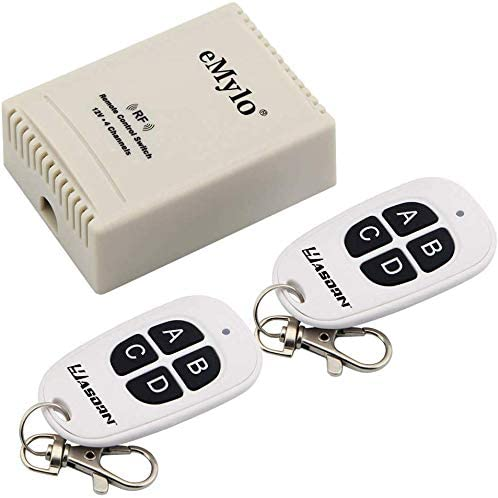

# eMylo RF Remote Control

These are remote control relay modules available off Amazon. Full name:

eMylo RF Remote Control 12V Relay Switch Wireless Switch 433Mhz One 4-Channel with Two Transmitters

https://www.amazon.ca/gp/product/B081V3N4HK

I've captured signals from the two remotes that come in the package.

## Samples

`01/` directory:

Button A: `[00] {24} a4 d5 ed  : 10100100 11010101 11101101`  
Button B: `[00] {24} a4 d5 eb  : 10100100 11010101 11101011`  
Button C: `[00] {24} a4 d5 e7  : 10100100 11010101 11100111`  
Button D: `[00] {24} a4 d5 ee  : 10100100 11010101 11101110`

`02/` directory:

Button A: `[00] {24} 21 0f dd  : 00100001 00001111 11011101`  
Button B: `[00] {24} 21 0f db  : 00100001 00001111 11011011`  
Button C: `[00] {24} 21 0f d7  : 00100001 00001111 11010111`  
Button D: `[00] {24} 21 0f de  : 00100001 00001111 11011110`

## Photo

