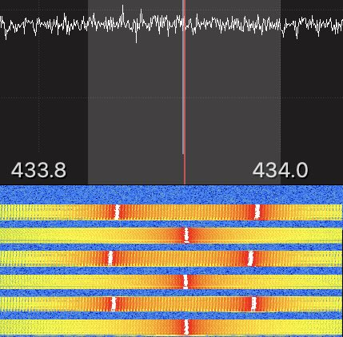

# Airkey AK3TX4

This is a remote control for operating things like garage doors, 
typically deployed in a shared space like an office building or apartment block.

### Manufacturer Description
Developed by Western Australian company "Neatrol systems".

Neatrol have this to say about the device

> The AKTX4 remote control and AKRX42-P / AKRX42-S / AKRX44-S is the highest security general remote control system available today. This system is aimed at general remote control applications which up until now have been hopelessly lacking in any intrinsic security whatsoever.
> 
> Until now all other general remote control transmitters by their nature can be easily reprogrammed to match any other transmitter made by the same manufacturer. This is unavoidable as these remote control transmitters have their code set via user adjustable miniature switches. This means that it is easy to look at the switch setting of someone's remote control and then set the same code on another transmitter made by the same manufacturer. The "copied" transmitter is indistinguishable from the original and will operate just as effectively - without the knowledge of the original owner.
> 
> Such a scenario is not possible with the AKTX4 as each transmitter is electronically factory programmed with a guaranteed unique and non-repeating serial number and encryption code. It is not possible for a transmitter to be duplicated since the transmitter's full serial number cannot be derived from it's transmissions without prior knowledge of it's secret 64 bit encryption key. Since the transmitter utilises a non linear encryption algorithm, this 64 bit encryption key also cannot be derived from any transmission. Thus the only way to duplicate a transmitter is to guess this number. Even if 1000 numbers were chosen at random every second, it would take over 500 million years to look at all 18 million million million combinations (18 with18 zeros).
> 
> Conventional systems also transmit the same code from a transmitter every time a button is pushed. The relative number of code combinations for a low end system is also a relatively small number. These shortcomings provide the means for a thief to create a device that ‘grabs’ a transmission and re-transmits it later or a device that scans all possible combinations until the correct one is found. Given the small number of code combinations (at most several thousand), and the high rate at which codes can be transmitted, it can be a matter of only seconds before a correct code is transmitted - even if all codes are used.
> 
> The AKTX4 employs sophisticated code hopping technology and an encryption algorithm to achieve an extremely high level of security. Code hopping is a method by which **the code transmitted from the transmitter to the receiver is different every time a button is pushed**. This method, coupled with a **transmission length of 69 bits**, virtually eliminates the use of code ‘grabbing’ or code ‘scanning’.

Emphassis added.

https://www.neatrol.com.au/products/Airkey/aktx4.html

### SOC

The remote uses a silicon labs Si4010-C2 SOC.

[Datasheet](https://www.silabs.com/documents/public/data-sheets/Si4010.pdf)

## Misc notes

- Seems like relativley old technology, the Airkey line of remotes seems to go back to 1986, the SOC itself seems to have been released around 2010, the neatrol website looks like it was designed in 1998, and hasn't been updated much since 2011.
- Device label model number is AK3TX2R-W26, while the PCB model number is AK3TX4
- The Si4010 SOC has AES-128 acceleration, although neatrol describe the encryption as 64 bit.

Seems to me, that while deriving the device serial number from transmissions may be cryptograhically infeasible, 
it should be possible to simply replay it's messages.

Unless the receiver won't open for any message it's seen before, but looking at the specs for the receiver, 
it has very constrained resources, seems highly unlikley that it has the resources to store much if any received messages.

## Signal observations

Disclaimer: I really have no idea what I'm doing when it comes to radio/SDR.  

Looking at the signal in GQRX, each time the remote button is pressed, it seems to produce a signal of:

- 6 pulses
- over a total period of ~330ms
- ~40ms pulse, followed by a
- ~20ms gap between each pulse

## Samples

When recording samples with `rtl_433 -S unknown`, rtl_433 seems to produce two files for each button press, 
I am not sure how it make it include the whole button press sample in one file.

[Sample 1](01/) Single button press.

[Sample 2](02/) Another single button press.