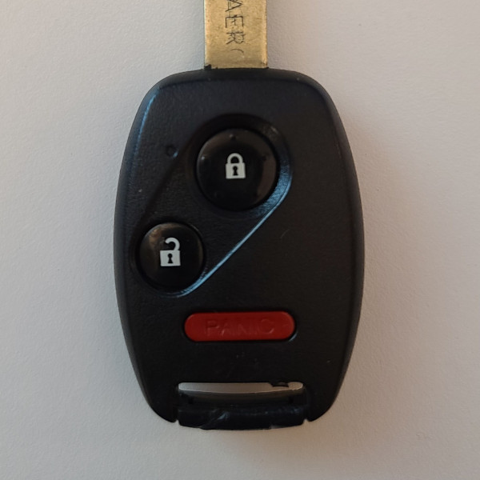

# Alps FWB1U545 - Car Remote

## Manufacturer
- Alps Electric

## Supported Models
- FWB1U545, (FCC ID CWTWB1U545) (OEM for Honda)

## Notes
The transmitter uses a fixed code an unencrypted sequence number.

### Button operation
This transmitter has up to 4 buttons which can be pressed once to transmit a single message.

The panic button is held for a unique code.

## Images
* Front

  

## Expected Test Output

* `unlock_433.92M_250k.cu8`

  ```
  model     : Alps-FWB1U545 ID        : 4817E61E
  Button Code: 1           Button    : Unlock        Sequence  : 34787
  ```

* `lock_433.92M_250k.cu8`

  ```
  model     : Alps-FWB1U545 ID        : 4817E61E
  Button Code: 14          Button    : Lock          Sequence  : 34788
  ```

* `panic_433.92M_250k.cu8`

  ```
  model     : Alps-FWB1U545 ID        : 4817E61E
  Button Code: 12          Button    : Panic         Sequence  : 34790
  ```

* `panic_held_433.92M_250k.cu8`

  ```
  model     : Alps-FWB1U545 ID        : 4817E61E
  Button Code: 5           Button    : Panic Held    Sequence  : 34791
  _ _ _ _ _ _ _ _ _ _ _ _ _ _ _ _ _ _ _ _ _ _ _ _ _ _ _ _ _ _ _ _ _ _ _ _ _ _ _ _ _ _ _ _ _ _ _ _ _ _ _ _ _ _ _ _ _ _ _ _ _ _ _ _ _ _ _ _ _ _ _ _
  model     : Alps-FWB1U545 ID        : 4817E61E
  Button Code: 5           Button    : Panic Held    Sequence  : 34791
  _ _ _ _ _ _ _ _ _ _ _ _ _ _ _ _ _ _ _ _ _ _ _ _ _ _ _ _ _ _ _ _ _ _ _ _ _ _ _ _ _ _ _ _ _ _ _ _ _ _ _ _ _ _ _ _ _ _ _ _ _ _ _ _ _ _ _ _ _ _ _ _
  model     : Alps-FWB1U545 ID        : 4817E61E
  Button Code: 5           Button    : Panic Held    Sequence  : 34791
  _ _ _ _ _ _ _ _ _ _ _ _ _ _ _ _ _ _ _ _ _ _ _ _ _ _ _ _ _ _ _ _ _ _ _ _ _ _ _ _ _ _ _ _ _ _ _ _ _ _ _ _ _ _ _ _ _ _ _ _ _ _ _ _ _ _ _ _ _ _ _ _
  model     : Alps-FWB1U545 ID        : 4817E61E
  Button Code: 5           Button    : Panic Held    Sequence  : 34791
  ```