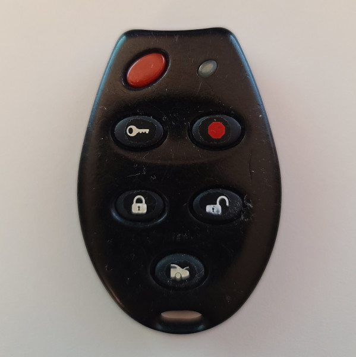

# Astrostart 2000 - Car Remote

## Manufacturer
- Astroflex

## Supported Models
- Astrostart 2000 (FCC ID J5F-TX2000)
- Astrostart 3000 (FCC ID J5F-TX2000)

## Notes

The transmitter uses a fixed code message. Each button press will always send three messages.

### Button operation
This transmitter has 5 (Astrostart 2000) or 6 (Astrostart 3000) buttons.
One or two buttons at a time can be pressed and held to send a unique code.
Pressing three buttons will result in a code, but is not unique to different button combinations.

### Using the primary / secondary serial number

The transmitter supports two sending two serial numbers.
Press and hold a button combination once to use the primary serial number.

The second serial number can be used by pressing the buttons in the below sequence:
1. Press a button or button combination twice, holding the combinations on the second press.
2. Hold the buttons down until you hear the four beeps / see the led flash slowly four times.

Note: The panic button will always send two messages on the primary serial number, and one message on the secondary number.

## Images
* Front

  


## Expected Test Output

* lock_372.4M_250k.cu8
  ```
  model     : Astrostart-2000                        ID        : 3410DE88
  Button Code: 43          Button    : Lock          Integrity : CHECKSUM
  _ _ _ _ _ _ _ _ _ _ _ _ _ _ _ _ _ _ _ _ _ _ _ _ _ _ _ _ _ _ _ _ _ _ _ _ _ _ _ _ _ _ _ _ _ _ _ _ _ _ _ _ _ _ _ _ _ _ _ _ _ _ _ _ _ _ _ _ _ _ _ _
  model     : Astrostart-2000                        ID        : 3410DE88
  Button Code: 43          Button    : Lock          Integrity : CHECKSUM
  _ _ _ _ _ _ _ _ _ _ _ _ _ _ _ _ _ _ _ _ _ _ _ _ _ _ _ _ _ _ _ _ _ _ _ _ _ _ _ _ _ _ _ _ _ _ _ _ _ _ _ _ _ _ _ _ _ _ _ _ _ _ _ _ _ _ _ _ _ _ _ _
  model     : Astrostart-2000                        ID        : 3410DE88
  Button Code: 43          Button    : Lock          Integrity : CHECKSUM

  ```
* lock_secondary_372.4M_250k.cu8
  ```
  model     : Astrostart-2000                        ID        : 0410DE88
  Button Code: 43          Button    : Lock          Integrity : CHECKSUM
  _ _ _ _ _ _ _ _ _ _ _ _ _ _ _ _ _ _ _ _ _ _ _ _ _ _ _ _ _ _ _ _ _ _ _ _ _ _ _ _ _ _ _ _ _ _ _ _ _ _ _ _ _ _ _ _ _ _ _ _ _ _ _ _ _ _ _ _ _ _ _ _
  model     : Astrostart-2000                        ID        : 0410DE88
  Button Code: 43          Button    : Lock          Integrity : CHECKSUM
  _ _ _ _ _ _ _ _ _ _ _ _ _ _ _ _ _ _ _ _ _ _ _ _ _ _ _ _ _ _ _ _ _ _ _ _ _ _ _ _ _ _ _ _ _ _ _ _ _ _ _ _ _ _ _ _ _ _ _ _ _ _ _ _ _ _ _ _ _ _ _ _
  model     : Astrostart-2000                        ID        : 0410DE88
  Button Code: 43          Button    : Lock          Integrity : CHECKSUM

  ```
* panic_372.4M_250k.cu8
  ```
  model     : Astrostart-2000                        ID        : 3410DE88
  Button Code: 31          Button    : Panic         Integrity : CHECKSUM
  _ _ _ _ _ _ _ _ _ _ _ _ _ _ _ _ _ _ _ _ _ _ _ _ _ _ _ _ _ _ _ _ _ _ _ _ _ _ _ _ _ _ _ _ _ _ _ _ _ _ _ _ _ _ _ _ _ _ _ _ _ _ _ _ _ _ _ _ _ _ _ _
  model     : Astrostart-2000                        ID        : 0410DE88
  Button Code: 31          Button    : Panic         Integrity : CHECKSUM
  _ _ _ _ _ _ _ _ _ _ _ _ _ _ _ _ _ _ _ _ _ _ _ _ _ _ _ _ _ _ _ _ _ _ _ _ _ _ _ _ _ _ _ _ _ _ _ _ _ _ _ _ _ _ _ _ _ _ _ _ _ _ _ _ _ _ _ _ _ _ _ _
  model     : Astrostart-2000                        ID        : 3410DE88
  Button Code: 31          Button    : Panic         Integrity : CHECKSUM

  ```
* start_372.4M_250k.cu8
  ```
  model     : Astrostart-2000                        ID        : 3410DE88
  Button Code: 19          Button    : Start         Integrity : CHECKSUM
  _ _ _ _ _ _ _ _ _ _ _ _ _ _ _ _ _ _ _ _ _ _ _ _ _ _ _ _ _ _ _ _ _ _ _ _ _ _ _ _ _ _ _ _ _ _ _ _ _ _ _ _ _ _ _ _ _ _ _ _ _ _ _ _ _ _ _ _ _ _ _ _
  model     : Astrostart-2000                        ID        : 3410DE88
  Button Code: 19          Button    : Start         Integrity : CHECKSUM
  _ _ _ _ _ _ _ _ _ _ _ _ _ _ _ _ _ _ _ _ _ _ _ _ _ _ _ _ _ _ _ _ _ _ _ _ _ _ _ _ _ _ _ _ _ _ _ _ _ _ _ _ _ _ _ _ _ _ _ _ _ _ _ _ _ _ _ _ _ _ _ _
  model     : Astrostart-2000                        ID        : 3410DE88
  Button Code: 19          Button    : Start         Integrity : CHECKSUM

  ```
* stop_372.4M_250k.cu8
  ```
  model     : Astrostart-2000                        ID        : 3410DE88
  Button Code: 47          Button    : Stop          Integrity : CHECKSUM
  _ _ _ _ _ _ _ _ _ _ _ _ _ _ _ _ _ _ _ _ _ _ _ _ _ _ _ _ _ _ _ _ _ _ _ _ _ _ _ _ _ _ _ _ _ _ _ _ _ _ _ _ _ _ _ _ _ _ _ _ _ _ _ _ _ _ _ _ _ _ _ _
  model     : Astrostart-2000                        ID        : 3410DE88
  Button Code: 47          Button    : Stop          Integrity : CHECKSUM
  _ _ _ _ _ _ _ _ _ _ _ _ _ _ _ _ _ _ _ _ _ _ _ _ _ _ _ _ _ _ _ _ _ _ _ _ _ _ _ _ _ _ _ _ _ _ _ _ _ _ _ _ _ _ _ _ _ _ _ _ _ _ _ _ _ _ _ _ _ _ _ _
  model     : Astrostart-2000                        ID        : 3410DE88
  Button Code: 47          Button    : Stop          Integrity : CHECKSUM

  ```
