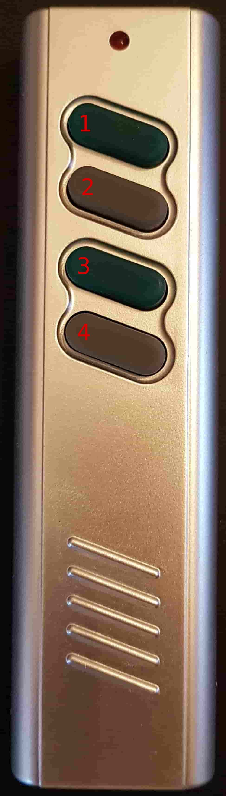
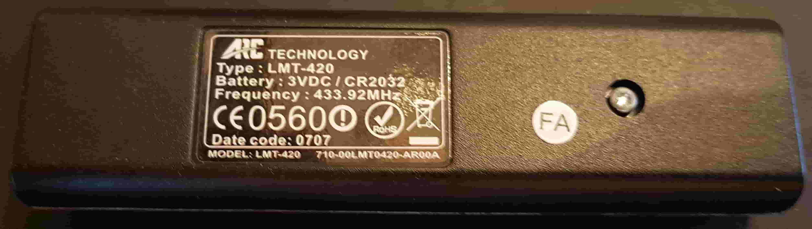
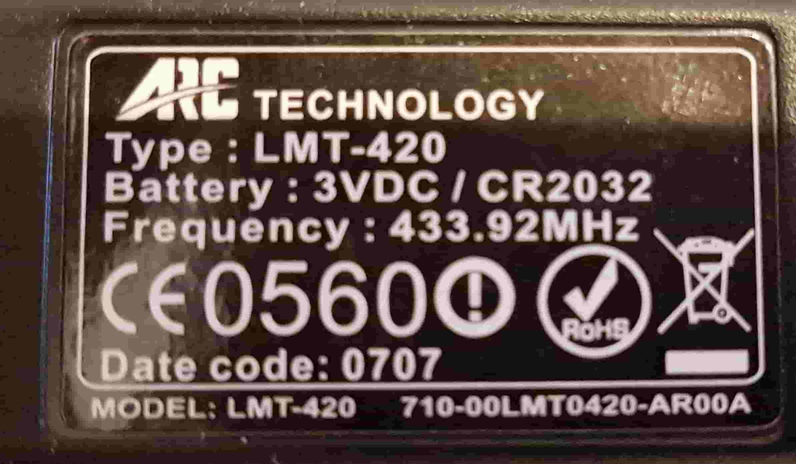
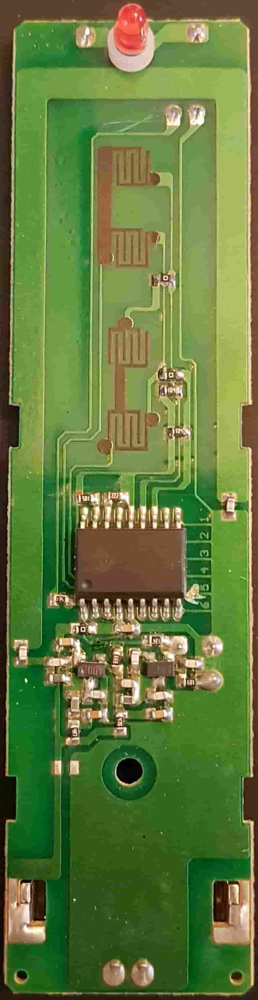
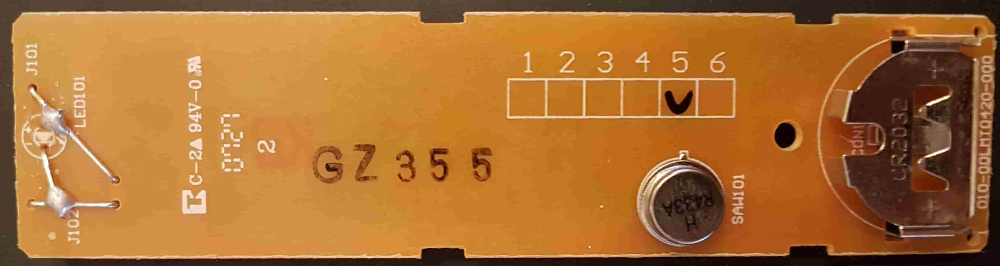

# LMT-420

The LMT-420 is a handheld remote that was delivered with my room lamp years ago. It uses 433MHz in order to control the brightness of the lamp.

### Data of Buttons
The transmitted data of the buttons seem to be:

| Button | Data       |
|--------|------------|
|    1   | 0x2CAD4C80 |
|    2   | 0x2CAD2A80 |
|    3   | 0x2CAD5500 |
|    4   | 0x2CAD3300 |

### Pictures
##### Outside
front: 
back: 
label: 

##### Inside
front: 
back: 
