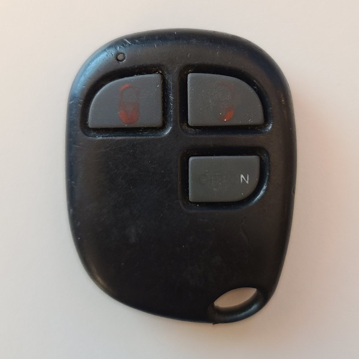

# Audiovox PRO-OE3B - Car Remote

## Manufacturer
- Audiovox

## Supported Models
- PRO-OE3B, AVX01BT3CL3 (FCC ID BGAOE3B)
- PRO-OE4B, AVX01BT3CL3 (FCC ID BGAOE3B)

## Notes

This transmitter uses a fixed code transmitting on 303.4 MHz.
The same code is continuously repeated while button is held down.
Multiple buttons can be pressed to set multiple button flags.

## Images
* Front

  