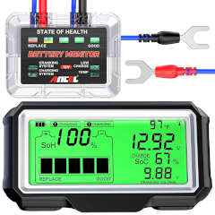

# BM5 v2.0 12V Automotive Battery Monitor

Manufactured by Shenzhen Leagend Optoelectronics Co. Ltd.  Sold as "ANCEL BM200" on Amazon, and "QUICKLYNKS BM5-D" on AliExpress
(I can't find any 3rd party testing reports on this 433mhz model, but this company also produces a popular Bluetooth version called the 
BM6 among other names, with an FCC-ID of 2AU4A-191114)

The monitor consists of a sensor/transmitter that attaches to the 12v battery, and a solar powered display/receiver that sits on the dash.  The transmitter sends all relevant data, once every 1-2 seconds at 433.92 MHz.

## Signal and Message Format
The transmission is inverted from the normal "OOK_PULSE_PWM" decoder, with a "0" represented as a short pulse of 225us, and a 675us gap,
and a "1" represented as a long 675us pulse, and a 225us gap.

Each message consists of a preamble (long pulse, plus eight 50% symbol length pulses) sent at double the normal data rate, then a one byte pause (at regular data rate),
then ten bytes of payload plus a one byte checksum.  The preamble is decoded as (0x7F 0x80) by rtl_433 (in the native, non-inverted state) due to the initial pulse.

Payload:

- I = 3 byte ID
- S = 7 bits for battery State of Health (SOH) - 0 to 100 percent
- C = 1 bit flag for charging system error (!CHARGING on display --probably triggered if running voltage below ~13v)
- s = 7 bits for battery State of Charge (SOC) 0 to 100 percent
- c = 1 bit flag for cranking system error. (!CRANKING indicator on display - triggered if starting voltage drops for too long -- excessive cranking)
- T = 8 byte (signed) for sensor temperature (degrees C, converted if necessary in display)
- V = 16 bits, little endian for current battery voltage (Voltage is displayed as a float with 2 significant digits.  The 16 bit int represents this
      voltage, multiplied by 1600.)
- v = 16 bits, little endian for previous low voltage during last start.  (Is probably used for the algorithm to determine battery health.  This value
      will be closer to resting voltage for healthy batteries) Same 1600 multiplier as above.
- R = 1 byte Checksum

    msg:    IIIIIIIIIIIIIIIIIIIIIIIISSSSSSSCssssssscTTTTTTTTVVVVVVVVVVVVVVVVvvvvvvvvvvvvvvvvRRRRRRRR
    ID:24h SOH:7d CHARGING:1b SOC:7d CRANKING:1b TEMP:8s V_CUR:16d V_START:16d CHECKSUM:8h

## Decoding using the `rtl_433` flex spec

`rtl_433 -r bm5v2_s1_433.92M_1024k.cu8 -R 0 -X 'n=bm5v2,m=OOK_PWM,s=227,l=675,r=6000,invert'`

## Sample Library

| cu8 Sample                                                         | Data Message                       | Decoded Data  |
|--------------------------------------------------------------------|------------------------------------|--------------------------------------------|
| [01/bm5v2_d1s1_433.92M_1024k.cu8](01/bm5v2_d1s1_433.92M_1024k.cu8) | {9}800, {88}f154b596c82ca2507b3728 | (Preamble), Device_ID : F154B5 State of Health: 75 %  Cranking System Error: 0  State of Charge: 100 %  Charging System Error: 0  Temperature: 44 C  Current Battery Voltage: 12.90 Starting Voltage: 8.88 |
| [01/bm5v2_d2s1_433.92M_1024k.cu8](01/bm5v2_d2s1_433.92M_1024k.cu8) | {9}800, {88}f1ac3a91be0a604e734495 | (Preamble), Device_ID : F1AC3A State of Health: 72 % Cranking System Error: 1  State of Charge: 95 %  Charging System Error: 0  Temperature: 10 C  Current Battery Voltage: 12.54  Starting Voltage: 10.95 |
| [01/bm5v2_d1s2_433.92M_1024k.cu8](01/bm5v2_d1s2_433.92M_1024k.cu8) | {9}800, {88}f154b586c614304ec345e0 | (Preamble), Device_ID : F154B5 State of Health: 67 % Cranking System Error: 0  State of Charge: 99 %  Charging System Error: 0  Temperature: 20 C  Current Battery Voltage: 12.51   Starting Voltage: 11.16 |

