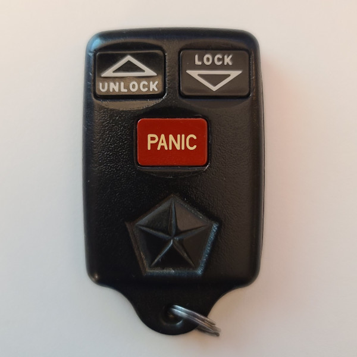

# Chrysler - Car Remote (315 MHz)

## Manufacturer
- Chrysler

## Supported Models
- 56008761
- 56008762 (FCC ID GQ43VT7T)
- 04686366
- 56021903AA

## Notes

The transmitter uses a fixed code message.

### Button operation
This transmitter has 3 buttons which can be pressed once to transmit a single message
Multiple buttons can be pressed down to send unique codes.

## Images
* Front

  

* Back

  