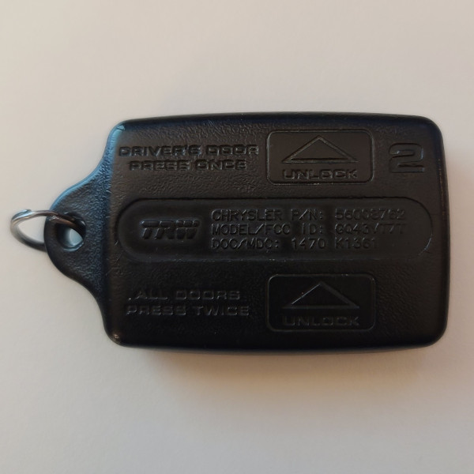

# Chrysler - Car Remote (315 MHz)

## Manufacturer
- Chrysler

## Supported Models
- 56008761
- 56008762 (FCC ID GQ43VT7T)
- 04686366
- 56021903AA

## Notes

The transmitter uses a fixed code message.

### Button operation
This transmitter has 3 buttons which can be pressed once to transmit a single message
Multiple buttons can be pressed down to send unique codes.

## Images
* Front

  

* Back

  


## Expected Test Output

* 01/lock_315.1M_920k.cu8
  ```
  model     : Chrysler-CarRemote                     ID        : 401A7FED
  Button Code: 2           Button    : Lock          Integrity : CHECKSUM
  ```

* 01/unlock_315.1M_920k.cu8
  ```
  model     : Chrysler-CarRemote                     ID        : 401A7FED
  Button Code: 1           Button    : Unlock        Integrity : CHECKSUM
  ```

* 01/panic_315.1M_920k.cu8
  ```
  model     : Chrysler-CarRemote                     ID        : 401A7FED
  Button Code: 4           Button    : Panic         Integrity : CHECKSUM
  ```

* 02/panic_315.1M_920k.cu8
  ```
  model     : Chrysler-CarRemote                     ID        : 40FC4ACD
  Button Code: 4           Button    : Panic         Integrity : CHECKSUM
  ```

* 03/panic_315.1M_920k.cu8
  ```
  model     : Chrysler-CarRemote                     ID        : 40E8CA2E
  Button Code: 4           Button    : Panic         Integrity : CHECKSUM
  ```

* 04/panic_315.1M_920k.cu8
  ```
  model     : Chrysler-CarRemote                     ID        : 40C58F03
  Button Code: 4           Button    : Panic         Integrity : CHECKSUM
  ```

* 05/panic_315.1M_920k.cu8
  ```
  model     : Chrysler-CarRemote                     ID        : 403F7033
  Button Code: 4           Button    : Panic         Integrity : CHECKSUM
  ```