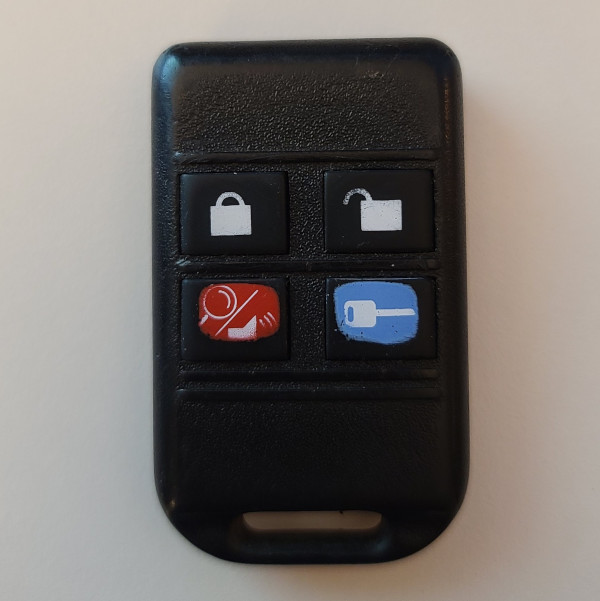

# Code Alarm FRDPC2002 - Car Remote

## Manufacturer
- Code Alarm

## Supported Models
- FRDPC2002, GOH-FRDPC2002

This transmitter uses a rolling code.
The same code is continuously repeated while button is held down.
Multiple buttons can be pressed to set multiple button flags.

## Images
* Front

  

## Expected Test Output

* `unlock_433.92M_250k.cu8`

  ```
  model     : CodeAlarm-FRDPC2002                    ID        : B1B988
  Button Code: 5           Button    : Unlock        Data      : 57CCD74FCC
  ```

* `lock_433.92M_250k.cu8`

  ```
  model     : CodeAlarm-FRDPC2002                    ID        : B1B988
  Button Code: 6           Button    : Lock          Data      : 697269F174
  ```

* `panic_433.92M_250k.cu8`

  ```
  model     : CodeAlarm-FRDPC2002                    ID        : B1B988
  Button Code: 1           Button    : Panic         Data      : 170C178F0C
  ```

* `start_433.92M_250k.cu8`

  ```
  model     : CodeAlarm-FRDPC2002                    ID        : B1B988
  Button Code: 0           Button    : Start         Data      : 069D861E9C
  ```

* `lock_unlock_433.92M_250k.cu8`

  ```
  model     : CodeAlarm-FRDPC2002                    ID        : B1B988
  Button Code: 4           Button    : Lock; Unlock  Data      : 465D46DE5C
  _ _ _ _ _ _ _ _ _ _ _ _ _ _ _ _ _ _ _ _ _ _ _ _ _ _ _ _ _ _ _ _ _ _ _ _ _ _ _ _ _ _ _ _ _ _ _ _ _ _ _ _ _ _ _ _ _ _ _ _ _ _ _ _ _ _ _ _ _ _ _ _
  model     : CodeAlarm-FRDPC2002                    ID        : B1B988
  Button Code: 4           Button    : Lock; Unlock  Data      : 465D46DE5C
  ```