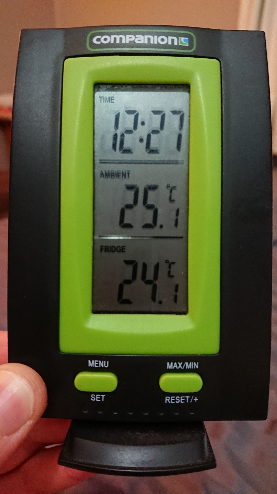
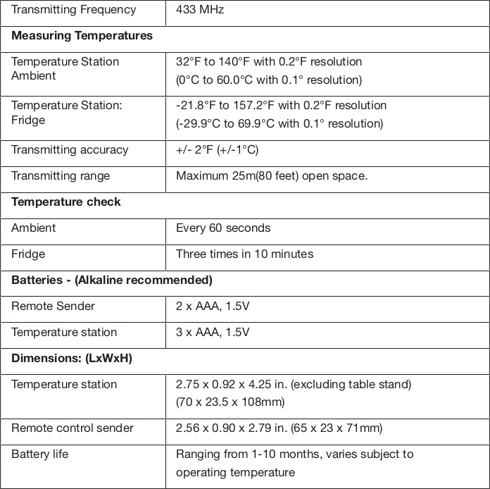
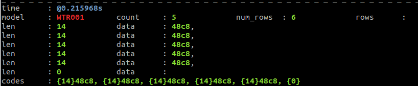

# Companion WTR001 Temperature Sensor

  


[Companion WTR001 Instruction Manual](https://www.manualslib.com/manual/1105005/Companion-Wtr001.html)

## Signal and Message Format

The signal is broadcast near 433.92 MHz as ASK/OOK.  Raw bits are 732 us in length, and may be 
demodulated using PWM over 4 raw bits.

Here's a view of pulses and gaps of the signal found in [01/g015_433.92M_250k.cu8](01/g015_433.92M_250k.cu8):


The raw bits, assuming each bit is 732 us, would be this message:

```
1100 10001110100010001110100010001000111011101000100011101000
1100 10001110100010001110100010001000111011101000100011101000
1100 10001110100010001110100010001000111011101000100011101000
1100 10001110100010001110100010001000111011101000100011101000
1100 10001110100010001110100010001000111011101000100011101000
1100
```

The `1100` at the beginning of each row is the SYNC.  Following that, groupings of 4 raw bits decode to logical bits using PWM. 
Raw bits `1000` decode to logical bit `0`, and raw bits `1110` decode to logical bit `1`. 
The PWM demodulated data, repeated 5 times between the SYNC bits, is the 14 bits `01001000110010`. 

Data layout (14 bits):

    DDDDDXTT TTTTTP

| Ordered Bits     | Description
|------------------|-------------
| 4,3,2,1,0        | DDDDD: Fractional part of Temperature. (DDDDD - 10) / 10
| 5                | X: Always 0 in testing. Maybe battery_OK or fixed
| 12,7,6,11,10,9,8 | TTTTTTT: Temperature in Celcius = (TTTTTTT + ((DDDDD - 10) / 10)) - 41
| 13               | P: Parity to ensure count of set bits in data is odd.

Temperature in Celcius = (bin2dec(bits 12,7,6,11,10,9,8) + ((bin2dec(bits 4,3,2,1,0) - 10) / 10 ) - 41

Published range of device is -29.9C to 69.9C

## Decoding using the `rtl_433` flex spec

`rtl_433 -r g015_433.92M_250k.cu8 -R 0 -X 'n=WTR001,m=OOK_PWM,s=732,l=2196,y=1464,r=2928,bits=14,invert'`




## Sample Library

| cu8 Sample | Data Message | Temperature Celcius
|------------|--------------|--------------------
| [01/g015_433.92M_250k.cu8](01/g015_433.92M_250k.cu8) | `{14}48c8` = `01001000110010` | 26.8
| [01/g018_433.92M_250k.cu8](01/g018_433.92M_250k.cu8) | `{14}c8cc` = `11001000110011` | 26.9
| [01/g019_433.92M_250k.cu8](01/g019_433.92M_250k.cu8) | `{14}50c8` = `01010000110010` | 26.0
| [01/g151_433.92M_250k.cu8](01/g151_433.92M_250k.cu8) | `{14}8bb0` = `10001011101100` | 20.7
| [01/g152_433.92M_250k.cu8](01/g152_433.92M_250k.cu8) | `{14}7330` = `01110011001100` | 19.4
| [01/g153_433.92M_250k.cu8](01/g153_433.92M_250k.cu8) | `{14}cb50` = `11001011010100` | 17.9
| [01/g156_433.92M_250k.cu8](01/g156_433.92M_250k.cu8) | `{14}d350` = `11010011010100` | 17.1
| [01/g157_433.92M_250k.cu8](01/g157_433.92M_250k.cu8) | `{14}4b94` = `01001011100101` | 16.8
