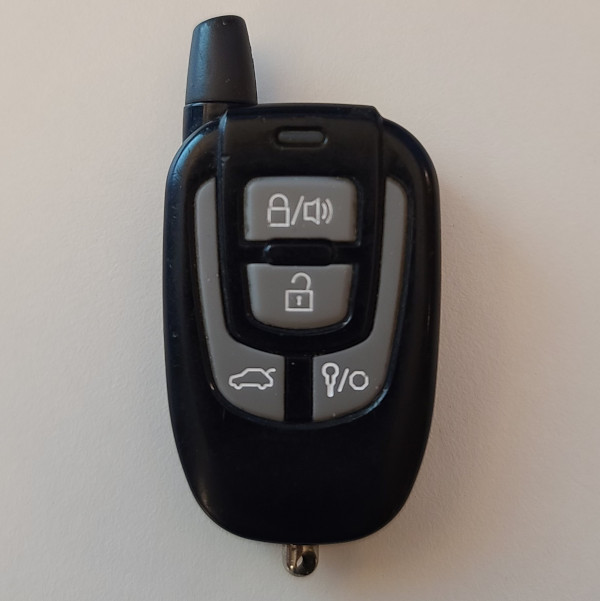

# Compustar 1WG3R - Car Remote

## Manufacturer
- Compustar

## Supported Models
- 1WG3R-SH
- 1WAMR-1900

## Notes

The transmitter uses a fixed code message with checksum

### Button operation
This transmitter has 4 buttons which can be pressed once to transmit a single message
Multiple buttons can be pressed down to send unique codes.

### Panic
Press and hold the lock button for 3 seconds.

### Long Press
Hold the button combination down for 2.5 seconds to send a long press signal.

### Secondary mode
Press and hold the unlock and the trunk buttons (II & III) at the same time. (press and hold for 2.5 seconds)
The LED will flash slowly indicating the remote is in the secondary mode.
Button presses are sent in batches by the remote when secondary mode is activated.

## Images
* Front

  