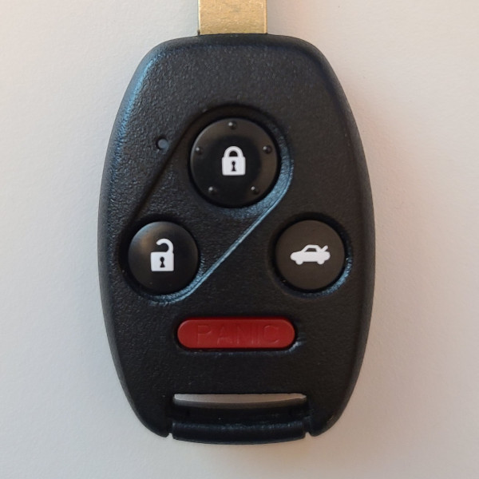
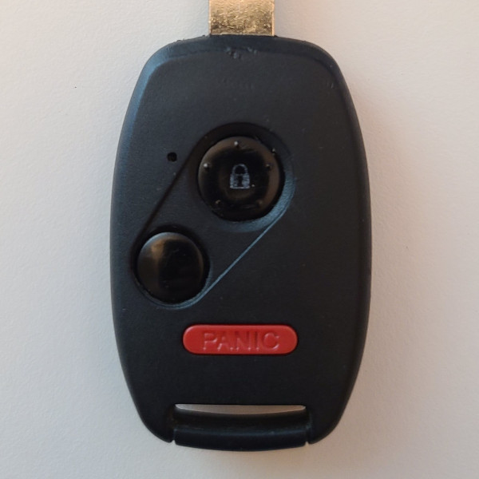

# Continental - Car Remote (313 MHz)

## Manufacturer
- Continental

## Supported Models
- 72147-SNA-A01 (FCC ID KR5V2X) (OEM for Honda)

## Notes

The transmitter uses a rolling with an unencrypted sequence number.

## Button operation
* The unlock, lock buttons can be pressed once to transmit a single message.
* The trunk, panic buttons will transmit the same code on a short press.
* The trunk, panic buttons will transmit the unique code on a long press.
* The panic button will repeat the panic code as long as it is held.

## Images
* Front - Example 1

  

* Front - Example 2

  

## Expected Test Output

* 01/lock_313.8M_1024k.cu8
  ```
  model     : Continental-KR5V2X                     ID        : F42E6789
  encrypted : 9391771C     Sequence  : 1522          Button Code: 1            Button    : Lock          Integrity : CHECKSUM
  _ _ _ _ _ _ _ _ _ _ _ _ _ _ _ _ _ _ _ _ _ _ _ _ _ _ _ _ _ _ _ _ _ _ _ _ _ _ _ _ _ _ _ _ _ _ _ _ _ _ _ _ _ _ _ _ _ _ _ _ _ _ _ _ _ _ _ _ _ _ _ _
  model     : Continental-KR5V2X                     ID        : F42E6789
  encrypted : 9391771C     Sequence  : 1522          Button Code: 1            Button    : Lock          Integrity : CHECKSUM
  ```
* 01/panic_long_press_313.8M_1024k.cu8
  ```
  model     : Continental-KR5V2X                     ID        : F42E6789
  encrypted : 8AC4A5B9     Sequence  : 1525          Button Code: 11           Button    : Panic Long Press                        Integrity : CHECKSUM
  _ _ _ _ _ _ _ _ _ _ _ _ _ _ _ _ _ _ _ _ _ _ _ _ _ _ _ _ _ _ _ _ _ _ _ _ _ _ _ _ _ _ _ _ _ _ _ _ _ _ _ _ _ _ _ _ _ _ _ _ _ _ _ _ _ _ _ _ _ _ _ _
  model     : Continental-KR5V2X                     ID        : F42E6789
  encrypted : 8AC4A5B9     Sequence  : 1525          Button Code: 11           Button    : Panic Long Press                        Integrity : CHECKSUM
  _ _ _ _ _ _ _ _ _ _ _ _ _ _ _ _ _ _ _ _ _ _ _ _ _ _ _ _ _ _ _ _ _ _ _ _ _ _ _ _ _ _ _ _ _ _ _ _ _ _ _ _ _ _ _ _ _ _ _ _ _ _ _ _ _ _ _ _ _ _ _ _
  model     : Continental-KR5V2X                     ID        : F42E6789
  encrypted : 8AC4A5B9     Sequence  : 1525          Button Code: 11           Button    : Panic Long Press                        Integrity : CHECKSUM
  _ _ _ _ _ _ _ _ _ _ _ _ _ _ _ _ _ _ _ _ _ _ _ _ _ _ _ _ _ _ _ _ _ _ _ _ _ _ _ _ _ _ _ _ _ _ _ _ _ _ _ _ _ _ _ _ _ _ _ _ _ _ _ _ _ _ _ _ _ _ _ _
  model     : Continental-KR5V2X                     ID        : F42E6789
  encrypted : 8AC4A5B9     Sequence  : 1525          Button Code: 11           Button    : Panic Long Press                        Integrity : CHECKSUM
  _ _ _ _ _ _ _ _ _ _ _ _ _ _ _ _ _ _ _ _ _ _ _ _ _ _ _ _ _ _ _ _ _ _ _ _ _ _ _ _ _ _ _ _ _ _ _ _ _ _ _ _ _ _ _ _ _ _ _ _ _ _ _ _ _ _ _ _ _ _ _ _
  model     : Continental-KR5V2X                     ID        : F42E6789
  encrypted : 8AC4A5B9     Sequence  : 1525          Button Code: 11           Button    : Panic Long Press                        Integrity : CHECKSUM
  _ _ _ _ _ _ _ _ _ _ _ _ _ _ _ _ _ _ _ _ _ _ _ _ _ _ _ _ _ _ _ _ _ _ _ _ _ _ _ _ _ _ _ _ _ _ _ _ _ _ _ _ _ _ _ _ _ _ _ _ _ _ _ _ _ _ _ _ _ _ _ _
  model     : Continental-KR5V2X                     ID        : F42E6789
  encrypted : 8AC4A5B9     Sequence  : 1525          Button Code: 11           Button    : Panic Long Press                        Integrity : CHECKSUM
  _ _ _ _ _ _ _ _ _ _ _ _ _ _ _ _ _ _ _ _ _ _ _ _ _ _ _ _ _ _ _ _ _ _ _ _ _ _ _ _ _ _ _ _ _ _ _ _ _ _ _ _ _ _ _ _ _ _ _ _ _ _ _ _ _ _ _ _ _ _ _ _
  model     : Continental-KR5V2X                     ID        : F42E6789
  encrypted : 8AC4A5B9     Sequence  : 1525          Button Code: 11           Button    : Panic Long Press                        Integrity : CHECKSUM
  _ _ _ _ _ _ _ _ _ _ _ _ _ _ _ _ _ _ _ _ _ _ _ _ _ _ _ _ _ _ _ _ _ _ _ _ _ _ _ _ _ _ _ _ _ _ _ _ _ _ _ _ _ _ _ _ _ _ _ _ _ _ _ _ _ _ _ _ _ _ _ _
  model     : Continental-KR5V2X                     ID        : F42E6789
  encrypted : 8AC4A5B9     Sequence  : 1525          Button Code: 11           Button    : Panic Long Press                        Integrity : CHECKSUM
  _ _ _ _ _ _ _ _ _ _ _ _ _ _ _ _ _ _ _ _ _ _ _ _ _ _ _ _ _ _ _ _ _ _ _ _ _ _ _ _ _ _ _ _ _ _ _ _ _ _ _ _ _ _ _ _ _ _ _ _ _ _ _ _ _ _ _ _ _ _ _ _
  model     : Continental-KR5V2X                     ID        : F42E6789
  encrypted : 8AC4A5B9     Sequence  : 1525          Button Code: 11           Button    : Panic Long Press                        Integrity : CHECKSUM
  ```
* 01/trunk_long_press_313.8M_1024k.cu8
  ```
  model     : Continental-KR5V2X                     ID        : F42E6789
  encrypted : C963C0B6     Sequence  : 1524          Button Code: 9            Button    : Trunk Long Press                        Integrity : CHECKSUM
  _ _ _ _ _ _ _ _ _ _ _ _ _ _ _ _ _ _ _ _ _ _ _ _ _ _ _ _ _ _ _ _ _ _ _ _ _ _ _ _ _ _ _ _ _ _ _ _ _ _ _ _ _ _ _ _ _ _ _ _ _ _ _ _ _ _ _ _ _ _ _ _
  model     : Continental-KR5V2X                     ID        : F42E6789
  encrypted : C963C0B6     Sequence  : 1524          Button Code: 9            Button    : Trunk Long Press                        Integrity : CHECKSUM
  ```
* 01/trunk_panic_short_press_313.8M_1024k.cu8
  ```
  model     : Continental-KR5V2X                     ID        : F42E6789
  encrypted : 80D3606B     Sequence  : 1524          Button Code: 10           Button    : Trunk/Panic Short Press                 Integrity : CHECKSUM
  _ _ _ _ _ _ _ _ _ _ _ _ _ _ _ _ _ _ _ _ _ _ _ _ _ _ _ _ _ _ _ _ _ _ _ _ _ _ _ _ _ _ _ _ _ _ _ _ _ _ _ _ _ _ _ _ _ _ _ _ _ _ _ _ _ _ _ _ _ _ _ _
  model     : Continental-KR5V2X                     ID        : F42E6789
  encrypted : 80D3606B     Sequence  : 1524          Button Code: 10           Button    : Trunk/Panic Short Press                 Integrity : CHECKSUM
  ```
* 01/unlock_313.8M_1024k.cu8
  ```
  model     : Continental-KR5V2X                     ID        : F42E6789
  encrypted : 8ED2F8E3     Sequence  : 1523          Button Code: 3            Button    : Unlock        Integrity : CHECKSUM
  _ _ _ _ _ _ _ _ _ _ _ _ _ _ _ _ _ _ _ _ _ _ _ _ _ _ _ _ _ _ _ _ _ _ _ _ _ _ _ _ _ _ _ _ _ _ _ _ _ _ _ _ _ _ _ _ _ _ _ _ _ _ _ _ _ _ _ _ _ _ _ _
  model     : Continental-KR5V2X                     ID        : F42E6789
  encrypted : 8ED2F8E3     Sequence  : 1523          Button Code: 3            Button    : Unlock        Integrity : CHECKSUM
  ```
* 02/lock_313.8M_1024k.cu8
  ```
  model     : Continental-KR5V2X                     ID        : 2A791780
  encrypted : C5B7F6D2     Sequence  : 54403         Button Code: 1            Button    : Lock          Integrity : CHECKSUM
  _ _ _ _ _ _ _ _ _ _ _ _ _ _ _ _ _ _ _ _ _ _ _ _ _ _ _ _ _ _ _ _ _ _ _ _ _ _ _ _ _ _ _ _ _ _ _ _ _ _ _ _ _ _ _ _ _ _ _ _ _ _ _ _ _ _ _ _ _ _ _ _
  model     : Continental-KR5V2X                     ID        : 2A791780
  encrypted : C5B7F6D2     Sequence  : 54403         Button Code: 1            Button    : Lock          Integrity : CHECKSUM
  ```
* 02/unlock_313.8M_1024k.cu8
  ```
  model     : Continental-KR5V2X                     ID        : 2A791780
  encrypted : B90057D2     Sequence  : 54405         Button Code: 3            Button    : Unlock        Integrity : CHECKSUM
  _ _ _ _ _ _ _ _ _ _ _ _ _ _ _ _ _ _ _ _ _ _ _ _ _ _ _ _ _ _ _ _ _ _ _ _ _ _ _ _ _ _ _ _ _ _ _ _ _ _ _ _ _ _ _ _ _ _ _ _ _ _ _ _ _ _ _ _ _ _ _ _
  model     : Continental-KR5V2X                     ID        : 2A791780
  encrypted : B90057D2     Sequence  : 54405         Button Code: 3            Button    : Unlock        Integrity : CHECKSUM
  ```
