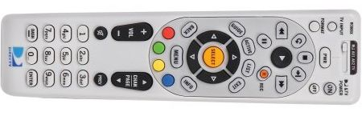
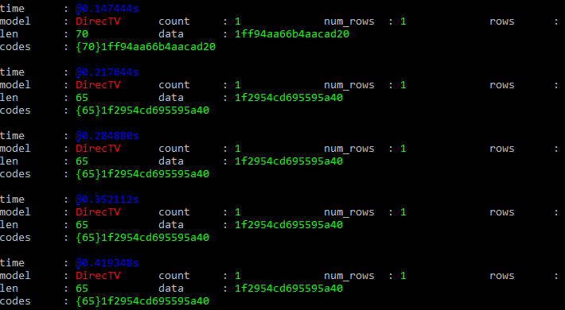
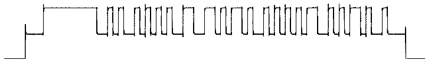

# DirecTV RC66RX Remote Control

[DirecTV RC66RX FCC Info](https://fccid.io/MG33013)

## Contents
* [Description](#description)
* [Signal](#signal)
* [Row Format](#row-format)
* [Row Interpretation](#row-interpretation)
* [Button Code Mapping](#button-code-mapping)
* [Example](#example)
* [Sample Library](#sample-library)

## Description ##

This signal format is generated by DirecTV remote controllers such as the
RC64RB, RC65RX, and RC66RX.  Samples in the collection were generated by the
RC66RX.

This series of remote controllers features both IR and RF modes.  The "R" after
the number refers to remote's ability to transmit DirecTV functions in RF mode.
There are models such as the RC66X which do NOT have the ability to operate in
RF mode.

These devices also feature a selector switch for discrete DirecTV/AV1/AV2/TV
operation and the ability to program those AV1/AV2/TV positions so that the
device will transmit IR signals compatible with many other manufacturer/model
devices.

In RF mode, this series of remotes operate near 433.92 MHz. Newer DirecTV
remotes, such as the RC73, operate in the 2425 MHz - 2475 MHz range and may use
a different protocol.

In RF mode, these remotes are believed to work with DirecTV receiver models such
as the R16, H20, H21, HR21, R22, H22, HR22, H23, HR23, H24, HR24, H25, H34,
HR34, and C31. It is believed that this remote will not work in RF mode with the
C41, HR44, HR54 or D12 model receivers.  This information is not verified and
may be inaccurate.

The DirecTV RF (and IR) modes of this remote may be programmed with a six-digit
Device ID. This is meant to pair the remote with a specific DirecTV receiver
(based on the last six digits of the receiver's serial number), but any six-
digit code is valid and this code is then transmitted as part of the signal.

By default, the remote control operates in IR mode. To put the remote control into RF mode:

1. Make sure slider on top is set to the left (DTV mode)
2. Press and hold MUTE & SELECT, wait for two blinks, release
3. Press 9 6 1
4. Press CHANNEL UP (CHANNEL DOWN would put the remote in IR mode)
5. Press any 6 digit code to be used as the Device ID number (sent with every signal)
6. Press SELECT

## Signal ##

The device uses a FSK to transmit a PCM signal TRANSMISSION.  Its FSK signal
seems to be centered around 433.92 MHz with its MARK and SPACE frequencies
each +/- 50 kHz from that center point.

A full signal TRANMISSION consists of ROWS, which are collections of SYMBOLS.
SYMBOLS, both the higher-frequency MARK (`1`) and lower-frequency SPACE
(`0`), have a width of 600μs.  If there is more than one ROW in a single
TRANSMISSION, there will be a GAP of 27,600μs of silence between each ROW.

A TRANSMISSION may be generated in response to an EVENT on the remote.  Observed
EVENTS that may trigger a TRANSMISSION seem limited to manual button presses.

## Row Format ##

Each ROW in the TRANSMISSION consists of two ordered parts -- its SYNC and its
MESSAGE.  Each ROW is expected to be complete; the device does not seem to ever
truncate a signal inside of a ROW.

The SYNC may be either a LONG SYNC or a SHORT SYNC. The LONG SYNC consists of
SYMBOLS `000111111111100`.  It is used in each row to signify that the MESSAGE
which follows will be the first time this unique MESSAGE will be seen in
this TRANSMISSION.

However, if a unique MESSAGE is to be sent more than once in a
TRANSMISSION, each subsequent ROW with this repeated MESSAGE will send a
SHORT SYNC instead of a LONG SYNC.  A SHORT SYNC consists of SYMBOLS
`0001111100`.

ROWS are typically repeated for the duration of the EVENT (a button push on the
remote) and a ROW is allowed to finish sending even if the EVENT ends before the
ROW is completely sent.

ROWS in any single TRANSMISSION usually contain the same MESSAGE, however this
is not always the case.  TRANSMISSIONS may be one ROW for some short EVENTS,
although some specific EVENTS generate TRANSMISSIONS of three rows, regardless
the duration of the EVENT.  Single TRANSMISSIONS have been observed to swtich
from one MESSAGE to another.  This seems to happen for specific buttons, such as
the [SELECT] button, which sends a single ROW containing a LONG SYNC and a
MESSAGE that encodes a new [SELECT RELEASE] MESSAGE.  Some buttons send one
MESSAGE during the initial duration of the EVENT, but then switch to a new
MESSAGE if the EVENT continues. Some TRANSMISSIONS stop sending ROWS after a
duration even if the EVENT continues.

LOGICAL DATA in the MESSAGE may be decoded from the ROW using some sort of
Differential Pulse Width Modulation (DPWM) method.  Between each SYMBOL
transition (both `1` to `0` and `0` to `1`) consider the number of SYMBOLS.  If
there is only one SYMBOL, the LOGICAL DATA bit is a `0`.  If there are two
SYMBOLS, the LOGICAL DATA bit is a `1`.  If there is 3 or more SYMBOLS, this is
not DATA - it is a sync pulse.  If a sync pulse is found (and is followed by
more SYMBOLS i.e. the SYMBOL does not occur at the end of the ROW), both it and
the one or two contiguous SYMBOLS after it are ignored and LOGICAL DATA would
resume decoding from that next transition.

## Logical Data Interpretation ##

After decoding, there should be 40 bits (5 bytes) of LOGICAL DATA.

LOGICAL DATA layout in nibbles:

MM DD DD DB BC

| Nibble # | Letter | Description                                                                |
|----------|--------|-------------                                                               |
| 0 - 1    | MM     | Model? Seems to always be 0x10                                             |
| 2 - 6    | DDDDD  | Device ID. 0x00000 - 0xF423F are valid (000000 - 999999 in decimal)        |
| 7 - 8    | BB     | Button Code. 0x00 - 0xFF maps to specific buttons or functions             |
| 9        | C      | Checksum. Least Significant Nibble of sum of previous 9 nibbles, 0x0 - 0xF |

## Button Code Mapping ##

Here's what I've been able to determine:

Click to show or hide button code mapping

Button codes span an entire logical byte of data, but decoding these codes to
button labels/meanings is likely incomplete.  RF signals are sent when the
remote has its selector switch in DirecTV mode (leftmost position), but RF
signals are sometimes sent when the remote is not in DirecTV mode (i.e., the
selector switch is in AV1, AV2, or TV positions) under certain conditions.

| Button Code | Description |
|-------------|-------------|
| 0x00 |  |
| 0x01 | [1] |
| 0x02 | [2] |
| 0x03 | [3] |
| 0x04 | [4] |
| 0x05 | [5] |
| 0x06 | [6] |
| 0x07 | [7] |
| 0x08 | [8] |
| 0x09 | [9] |
| 0x0A |  |
| 0x0B |  |
| 0x0C |  |
| 0x0D | [CH UP] |
| 0x0E | [CH DOWN] |
| 0x0F | [CH PREV] |
| 0x10 | [PWR] |
| 0x11 | [0] |
| 0x12 | [DASH] |
| 0x13 | [ENTER] |
| 0x14 | [DASH REPEAT] [5](#fn5) |
| 0x15 | [ENTER REPEAT] |
| 0x16 - 0x1F |  |
| 0x20 | [MENU] |
| 0x21 | [UP] |
| 0x22 | [DOWN] |
| 0x23 | [LEFT] |
| 0x24 | [RIGHT] |
| 0x25 | [SELECT] |
| 0x26 | [EXIT] |
| 0x27 | [BACK] |
| 0x28 | [GUIDE] |
| 0x29 | [ACTIVE] |
| 0x2A | [LIST] |
| 0x2B | LIST REPEAT] |
| 0x2C | INFO REPEAT] |
| 0x2D | GUIDE REPEAT] |
| 0x2E | [INFO] |
| 0x2F |  |
| 0x30 | [VCR PLAY] |
| 0x31 | [VCR STOP] |
| 0x32 | [VCR PAUSE] |
| 0x33 | [VCR RWD] |
| 0x34 | [VCR FFD] |
| 0x35 | [VCR REC] |
| 0x36 | [VCR BACK] |
| 0x37 | [VCR SKIP] |
| 0x38 | [VCR SKIP REPEAT] |
| 0x3A | [VCR PLAY REPEAT] |
| 0x3B | [VCR PAUSE REPEAT] |
| 0x3C | [VCR RWD REPEAT] |
| 0x3D | [VCR FFD REPEAT] |
| 0x3E | [VCR REC REPEAT] |
| 0x3F | [VCR BACK REPEAT] |
| 0x40 |  |
| 0x41 | [RED] |
| 0x42 | [YELLOW] |
| 0x43 | [GREEN] |
| 0x44 | [BLUE] |
| 0x45 | [MENU REPEAT] |
| 0x46 | [ACTIVE REPEAT] |
| 0x4A | [RED REPEAT] |
| 0x4B | [YELLOW REPEAT] |
| 0x4C | [GREEN REPEAT] |
| 0x4D | [BLUE REPEAT] |
| 0x4E |  |
| 0x4F |  |
| 0x50 |  |
| 0x51 | [TV: VCR {all} and just switched from other input - maybe alert to switch to other mode?] [3](#fn3) |
| 0x52 - 0x58 |  |
| 0x59 | [VOLUME UP/DOWN/MUTE ALERT] Maybe alert that no device set to handle volume controls? Sends exactly 3 rows each press[1](#fn1) |
| 0x5A | [AV1/AV2/TV: FORMAT,PWR,VCR {all}, EXIT, U/D/L/R/SEL, MENU, CH U/D/PREV, 0-9/DASH/ENTER] [1](#fn1) |
| 0x5B | [DTV&TV POWER ON/OFF], [TV INPUT], [VOLUME UP/DOWN/MUTE] [1](#fn1) |
| 0x5C | [AV1/AV2/TV: TV INPUT, DTV&TV POWER ON/OFF, VOL U/D/M - maybe alert that no TV IR Programmed?] [1](#fn1) |
| 0x5D | [TV:  GUIDE, ACTIVE, LIST, BACK, INFO, R/G/Y/B] [1](#fn1) |
| 0x5E | [AV1: GUIDE, ACTIVE, LIST, BACK, INFO, R/G/Y/B] [1](#fn1) |
| 0x5F | [AV2: GUIDE, ACTIVE, LIST, BACK, INFO, R/G/Y/B] [1](#fn1) |
| 0x60 | [0 REPEAT] |
| 0x61 | [1 REPEAT] |
| 0x62 | [2 REPEAT] |
| 0x63 | [3 REPEAT] |
| 0x64 | [4 REPEAT] |
| 0x65 | [5 REPEAT] |
| 0x66 | [6 REPEAT] |
| 0x67 | [7 REPEAT] |
| 0x68 | [8 REPEAT] |
| 0x69 | [9 REPEAT] |
| 0x6A - 0x6F |  |
| 0x70 - 0x72 |  |
| 0x73 | [FORMAT] |
| 0x74 | [] |
| 0x75 | [FORMAT REPEAT] |
| 0x76 - 0x7F |  |
| 0x80 | [DTV: DTV&TV POWER ON] [2](#fn2) |
| 0x81 | [DTV: DTV&TV POWER OFF] [2](#fn2) |
| 0x82 - 0x8F |  |
| 0x90 - 0x9F |  |
| 0xA0 - 0xAF |  |
| 0xB0 - 0xBF |  |
| 0xC0 - 0xCF |  |
| 0xD0 - 0xD5 |  |
| 0xD6 | [SELECT RELEASE] [4](#fn4) |
| 0xD7 - 0xDF |  |
| 0xE0 - 0xEF |  |
| 0xF0 - 0xFF |  |

<a name="fn1">[1]</a> If none of the AV1/AV2/TV switch configurations are
programmed with a Mfg/Model Device IR code.

<a name="fn2">[2]</a> If any of AV1/AV2/TV switch configurations are programmed
with a Mfg/Model Device IR code, DTV: DTV&TV ON/OFF send separate codes and the
TV Input button no longer sends an RF code

<a name="fn3">[3]</a> If any of the VCR control buttons have been pressed in any
of the DTV/AV1/AV2 switch settings, then switched to the IR programmed TV
setting, and then any of the VCR control buttons pressed, the device sends this
code the first (and only the first) time a VCR control button is pressed in that
mode.

<a name="fn4">[4]</a> Sent once with a long SYNC when the select button is
released.

<a name="fn5">[5]</a> Several buttons switch to another code if the button is
held down for several seconds.

## Example ##

For this example, the remote has been programmed with device ID "123456" using
the method detailed in a previous section.  The sample file
[`01/g004_433.92M_250k.cu8`](01/g004_433.92M_250k.cu8) was captured with
`rtl_433 -g 20 -S all` when the <code>[VCR&nbsp;PLAY]</code> button on the
remote was pressed.

Using `rtl_433` with the flex spec, here is the data in the signal:

`rtl_433 -r g004_433.92M_250k.cu8 -X n=DirecTV,m=FSK_PCM,s=600,l=600,r=2400`

Let's focus on the first row in that signal, `{70}1ff94aa66b4aacad20`.
Here's what these symbols look like in binary:

`0001111111111001010010101010011001101011010010101010110010101101001000`

Here's a representation of that part of the signal (as seen in
[URH](https://github.com/jopohl/urh)):

The first part of that signal row, `000111111111100`, is a LONG SYNC.  Because
there are 10 (instead of 5) `1` SYMBOLS, this row would be the first (or only)
repetition sent for this button press on the remote.

Next, the MESSAGE SYMBOLS.

<code>1010010101010011001101011010010101010110010101101001000</code>

Decoding these SYMBOLS into their LOGICAL bits, we get:

<code>0001&nbsp;00000001&nbsp;1&nbsp;1&nbsp;1&nbsp;0001&nbsp;001&nbsp;000000001&nbsp;1&nbsp;00001&nbsp;001&nbsp;0X</code>

We've reprented the final `000` SYMBOL decoding as `X` as this is not valid
data.  Also, the actual function of the `1` SYMBOL just before the final `000`
SYMBOLS is to act as a delimiter to the DATA, so we should ignore that decoded
LOGICAL `0` bit just before the `X`.

Our final decoded LOGICAL result is: `0001000000011110001001000000001100001001`

Taking those 40 bits and representing as hex, we get:

`0x101e240309`

We can break this apart into the Model `0x10`, Device ID `0x1e240`, Button ID
`0x30`, and Checksum `0x9`.

Model `0x10` is correct, Device ID `0x1e240` in decimal is `123456`, and Button
ID `0x30` corresponds to the <code>[VCR&nbsp;PLAY]</code> button label.

The sum of the first 9 nibbles `0x1 + 0x0 + 0x1 + 0xe + 0x2 + 0x4 + 0x0 + 0x3 +
0x0` = `0x19` and the least signficant nibble of that total, `0x9`, matches the
Checksum nibble.

Furthermore, we see that there were 5 repetitions of the row, so we can get an
idea of how long the button was held down.

## Sample Library

| .cu8 Sample | ROW SYMBOLS | LOGICAL Data | Device ID / Button ID / Button Name|
|------------|----------|--------------|----------------|
| [01/g001_433.92M_250k.cu8](01/g001_433.92M_250k.cu8) | `{64}1ff94aaaaaab49a8`, `{59}1f2955555569350` × 4, `{66}1ff94aaaaaac934a0` | `0x1000000258` × 5, `0x1000000d64` | `000000` / `0x25` × 5, `0xd6` / `[SELECT]` × 5, <code>[SELECT&nbsp;RELEASE]</code> |
| [01/g002_433.92M_250k.cu8](01/g002_433.92M_250k.cu8) | `{65}1ff94aaaaaab4a640`, `{60}1f29555555694c8` × 3 | `0x1000000247` × 4 | `000000` / `0x24` / `[RIGHT]` |
| [01/g003_433.92M_250k.cu8](01/g003_433.92M_250k.cu8) | `{63}1ff94aaaaaab5250`, `{58}1f295555556a4a0` × 26 | `0x1000000214` × 27 | `000000` / `0x21` / `[UP]` |
| [01/g004_433.92M_250k.cu8](01/g004_433.92M_250k.cu8) | `{70}1ff94aa66b4aacad20`, `{65}1f2954cd695595a40` × 4 | `0x101e240309` × 5 | `123456` / `0x30` / <code>[VCR&nbsp;PLAY]</code> |

