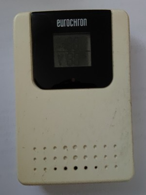

# Eurochron temperature and humidity sensor

## Modulation parameters

- modulation = OOK_PULSE_PPM,
- short_width = 1016,
- long_width = 2024,
- gap_limit = 2100,
- reset_limit = 8200,

## Datagram format

Datagram length is always 36 bits per row. 
Each datagram will be repeated multiple times per transmission for checking data integrity.

    IIIIIIII B00P0000 HHHHHHHH TTTTTTTT TTTT
      
      - I: ID (new ID will be generated at battery change!)
      - B: Battery low
      - P: TX-Button pressed
      - H: Humidity (%)
      - T: Temperature (°C * 10)
      - 0: Unknown / always zero

## Device type recognition

Device type identification is only possible by datagram length and some zero bits. Therefore this device is disabled by default (as it could easily trigger false alarms).

## Update intervals

- transmission time slot every 12 seconds 
- at least once within 120 seconds (with stable values) 
- down to 12 seconds (with rapidly changing values)

## Picture of device

