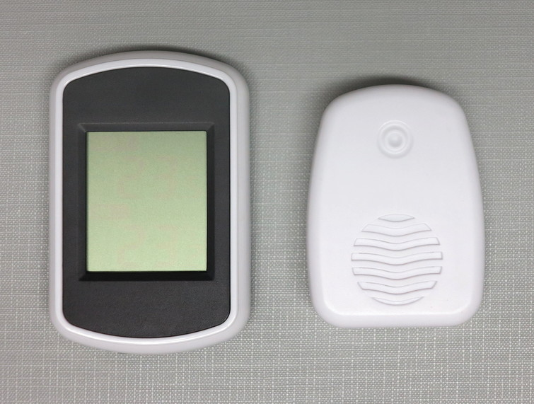

# FT-004-B

FT-004-B is a outdoor temperature sensor which is used in conjunction with a display unit. The kit looks similar to the Ambient Weather WS-04 kit. It is not yet confirmed if they are indeed compatible.

