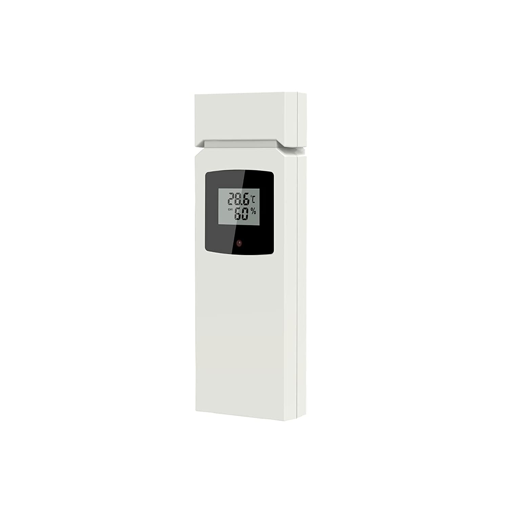

# Geevon TX16-3
This device is a simple temperature/humidity transmitter with a small LCD display for local viewing.

A functional decoder (geevon.c) was written mostly by ChatGPT by providing it with the protocol specs I determined from the -a and -A output of rtl_433 and changing various parameters to determine positions. Only a few edits needed to be made to integrate it properly into rtl_433 and clean up its processing.

Look at the `capture-log.txt` in the device folder for a log mapping the decoded output to the capture files.
