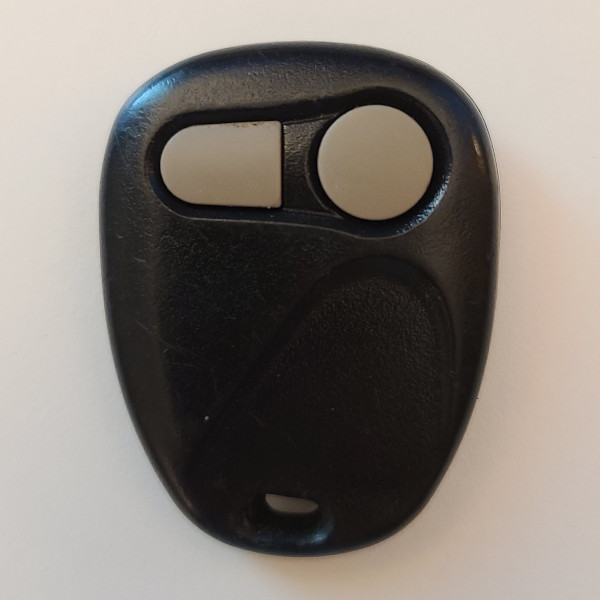
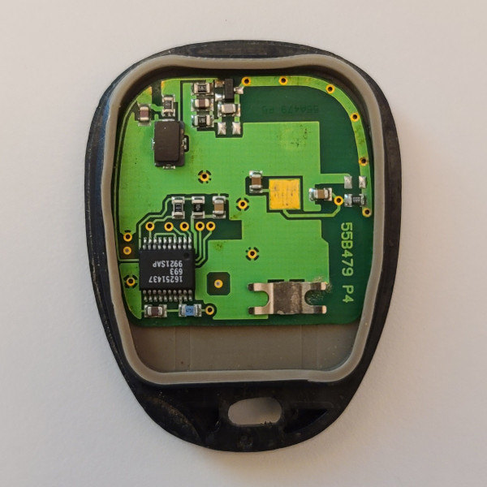

# General Motors - Car Remote (315 MHz)

## Manufacturer
- General Motors

## Supported Models
- ABO1502T

## Notes

The transmitter uses a rolling code message with an unencrypted sequence number.

## Button operation
This transmitter has 2 to 4 buttons which can be pressed once to transmit a single message.
Pressing both lock and unlock appears to send a fixed code, possibly a PRNG seed or secret key for the rolling code.

## Images
* Front

  

* Internal

  