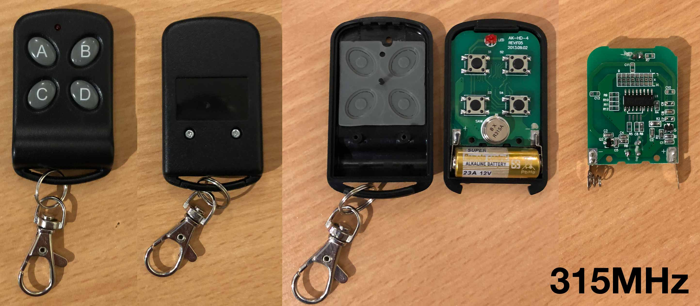

# Generic Black 4-Button 315MHz Remote

IC: SCT2260 (SOP-16) similar to PT2260
PCB: AK-HD-4 REV:F05 2013.09.02
Battery: 12V

The remote does not come with DIP switches. The jumper pads on the back must be soldered to change the address.

The same PCB is used by the generic black 4-button 433MHz remote, with a different encoder IC and a few different passives.



### Captures:

```
$ rtl_433 -f 315000000 -a -t
```

File               | Button
------------------ | ------
g001_315M_250k.cu8 | A
g002_315M_250k.cu8 | A
g003_315M_250k.cu8 | B
g004_315M_250k.cu8 | B
g005_315M_250k.cu8 | C
g006_315M_250k.cu8 | C
g007_315M_250k.cu8 | D
g008_315M_250k.cu8 | D

### Analyze mode:

Plain OOK with fixed period of 1800 us, long pulse 1380 us, short pulse 485 us.
Use e.g. -X name:OOK_PWM:484:1380:13616:1292:358:0

