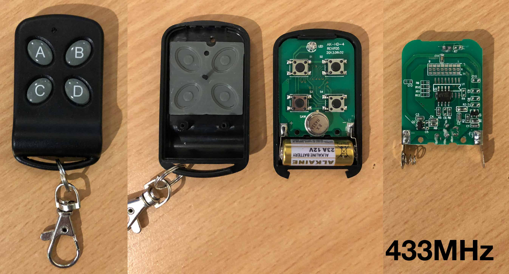

# Generic Black 4-Button 433MHz Remote

IC: EV1527 1500 (SOP-8)
PCB: AK-HD-4 REV:F05 2013.09.02
Battery: 12V

The remote does not come with DIP switches. The jumper pads on the back must be soldered to change the address.

The same PCB is used by the generic black 4-button 315MHz remote, with a different encoder IC and a few different passives.



### Captures:

```
$ rtl_433 -f 433920000 -a -t
```

File                  | Button
--------------------- | ------
g001_433.92M_250k.cu8 | A
g002_433.92M_250k.cu8 | A
g003_433.92M_250k.cu8 | B
g004_433.92M_250k.cu8 | B
g005_433.92M_250k.cu8 | C
g006_433.92M_250k.cu8 | C
g007_433.92M_250k.cu8 | D
g008_433.92M_250k.cu8 | D

### Analyze mode:

This is an interesting test case as the samples are very distorted. AM is rather low with high spikes.

It's simple OOK with fixed period of 1300 µs with long pulse at 1000 µs, short pulse at 350 µs.
The first sample should read 1000010000011001000001000 / 0x841904 (using long for 1, i.e. inverted). 25 bits as expected for this kind of device.

Forcing a very low trigger level will also show it in the am analyzer: `rtl_433 -q -l 1000 -a -r g001_433.92M_250k.cu8`

