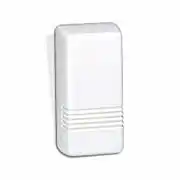

# Honeywell 5816 Door/Window Transmitter

<https://www.security.honeywell.com/product-repository/5816-5816br>

Two zone transmitter with both built-in magnetic reed switches and wired closed
circuit contact loop.

The 5800 Series of door and window transmitters provide the most reliable,
convenient and cost effective solutions for security protection. These
devices are powerful and versatile enough to help solve even the toughest,
most labor intensive installations.

With a demonstrated outdoor range of over a mile, the 5800 Series has the best
performance of any transmitters available today.
