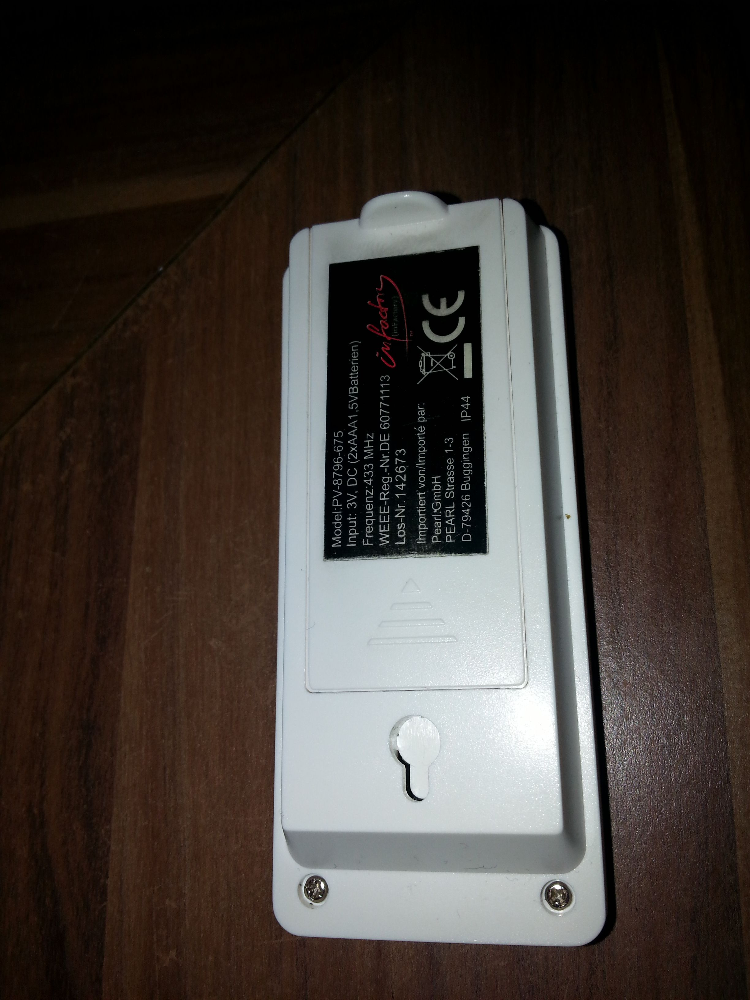

# inFactory PV-8796-675

## Shop-Link
http://www.pearl.de/a-PV8796-3041.shtml

## Sample Data

```
# rtl_433 -f 434052000 -l 10000 -a -t
```

| file            | temp in °C    | humidity in %  |
| :-------------: | ------------: | -------------: |
| gfile001.data   | 14.7          |   76           |
| gfile001.data   | 19.1          |   77           |
| gfile001.data   | 20.5          |   73           |

## Weather Station


## Sensor (front)


## Sensor (back)


## Sensor (inner)

