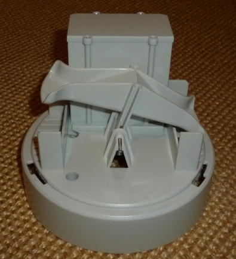
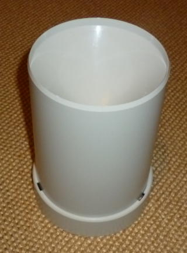

# LaCrosse TX34-IT rain gauge

## Device description

LaCrosse TX34-IT rain gauge is a part of LaCrosse WS3650 weather station, but
it can be bought alone
[here](https://en.lacrossetechnology.fr/P-20-A1-WSTX34IT.html).

It's a tipping bucket based rain gauge:

 

Tipping detection is done with a magnet (on buckets body) and a
[REED switch](https://en.wikipedia.org/wiki/Reed_switch) on the electronic
board.

## Specifications

* Overall height: 183 mm
* Overall diameter: 131 mm
* Collector diameter: 112.5 mm (99.4 cm²)
* Bucket tipping volume: ~2.2 mL
* Power supply: 2 AA 1.5 V batteries

## Radio transmission analyzis

LaCrosse TX34-IT is an "IT+" (Instant Transmission) device, like LaCrosse
TX29-IT temperature (and humidity) sensor ; it means a radio frame is
sent every few seconds, compared to every minute or more for other sensors.

This device sends a frame every 6.5 seconds.

Sample capture I/Q radio frame [`g001_868.3M_1000k.cu8`](g001_868.3M_1000k.cu8)
can be viewed on http://triq.net/iqs and shows a FSK modulated signal of +/-
60 kHz centered on 868.3 MHz.

Demodulated signal analyzis on SigRok/Pulseview (see
[`g001_868.3M_1000k.sr`](g001_868.3M_1000k.sr) file - analog parts are stripped)
reveals a 64 bits long FSK PCM frame with an average bit duration of 58 µs.

## Frame format

The 64 bits frame has the following format:

    0    4    8    12   16   20   24   28   32   36   40   44   48   52   56   60
    1010 1010 0010 1101 1101 0100 MMMM DDDD DDNW 0000 GGGG GGGG GGGG GGGG CCCC CCCC

* bits 0-7: preamble (up to the first two bits may be lost)
* bits 8-23: 0x2DD4 (IT+ frame identifier)
* bits 24-27 (M): model identifier (5 for rain gauge, 9 for thermo/hydro...)
* bits 28-33 (D): device ID (0 to 63, random at startup)
* bit 34 (N): new battery (up for about 420 minutes after startup)
* bit 35 (W): weak battery (up when battery voltage lower than 2 volts)
* bits 36-39: always 0
* bits 40-55 (G): bucket tipping counter (reset at startup, and may overflow after
  65535, but the batteries should be KO before that)
* bits 56-63 (C): 8 bits CRC (x^8+x^5+x^4+1, init=0 and no final XOR) calculated on
  bits 24-55

Since one or two bits of preamble should be lost, IT frames can be searched
with this 22 bits sequence: `10 1010 0010 1101 1101 0100`, i.e. `0xA8 0xB7 0x50`
(shifted left).

## Example frame

The decoded `g001_868.3M_1000k.cu8` sample capture gives the following bytes
sequence:

    0xAA 0x2D 0xD4 0x54 0x40 0x00 0x07 0xB3

Decoded values are:

* bits 24-27: 5 (it's a rain gauge)
* bits 28-33: 17 (random device ID)
* bit 34: 0 (started with new battery more than 7 hours ago)
* bit 35: 0 (battery voltage OK)
* bits 40-55: 7 (bucket tipping counter)
* bits 56-63: 0xB3 (valid CRC for bits 24 to 55)

## RTL_433 decoder

A new decoder (`lacrosse_tx34.c`) has been written for this device and the
`g001_868.3M_1000k.cu8` sample capture can be decoded with it:

    rtl_433 -s 1000k -r g001_868.3M_1000k.cu8

JSON result:

    {
        "time" : "@0.045423s",
        "model" : "LaCrosse TX34-IT",
        "id" : 17,
        "battery_ok" : 1,
        "newbattery" : 0,
        "rain_mm" : 1.554,
        "rain_raw" : 7,
        "mic" : "CRC"
    }
