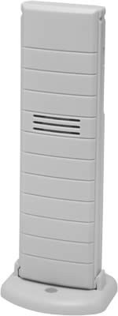

# Lacrosse TX37U-IT Wireless Temperature Sensor

Manufacturer's Page: [Lacrosse TX37U-IT](https://www.lacrossetechnology.com/tx37u-it)

## Specs:

* Temperature range: -39.8°F to +139.8°F (-39.9°C to +59.9°C)
* Transmission frequency: 915 MHz FSK
* Dimensions: 1.50" L x 0.83" W x 5.05" H

FCC ID: https://fccid.io/OMO-TX29U

Note: Uses same protocall as tx29-it & tx35dth-it, only freq is different (915MHz)
