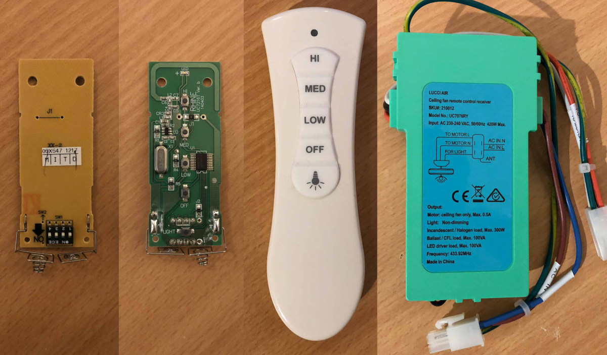

# Lucci Air Slimline Ceiling Fan Remote

<https://www.beaconlighting.com.au/lucci-fan-slimline-remote-1.html>

* SKU: 210012
* Model: UC7216T (transmitter), UC7076RY (receiver)
* Voltage: 2x 1.5V AAA (transmitter), 230-240VAC 50/60Hz (receiver)
* Frequency: 433.92MHz
* Range: Approx. 20-30 feet
* Made in China

* PCB: RHINE UC7216T Ver. b 140403
* MCU: RHINE RH787T, RH787T3B-T 17ADP03B
* FCC ID: Similar to CHQ7216T, but with white buttons and 433.92MHz

* 5 buttons, 4 DIP switches, 1 red LED.

### Buttons:

* 1: HI
* 2: MED
* 3: LOW
* 4: OFF
* 5: LIGHT



In the examples below I've pressed each of the 5 buttons with each of the 16 DIP switch combinations.
DIP=0001 means only the 4th DIP switch from the left is ON/up. The rest OFF/down.

Captured at 433.988265 MHz with RTL-SDR.com Blog V3 dongle.

### Captures:

```
$ rtl_433 -f 433987000 -a -t
```

File                   | DIP  | Button
---------------------- | ---- | ------------------
g001_433.987M_250k.cu8 | 0000 | HI
g002_433.987M_250k.cu8 | 0000 | MED
g003_433.987M_250k.cu8 | 0000 | LOW
g004_433.987M_250k.cu8 | 0000 | OFF
g005_433.987M_250k.cu8 | 0000 | LIGHT
g006_433.987M_250k.cu8 | 0001 | HI
g007_433.987M_250k.cu8 | 0001 | MED
g008_433.987M_250k.cu8 | 0001 | LOW
g009_433.987M_250k.cu8 | 0001 | OFF
g010_433.987M_250k.cu8 | 0001 | LIGHT
g011_433.987M_250k.cu8 | 0010 | HI
g012_433.987M_250k.cu8 | 0010 | MED
g013_433.987M_250k.cu8 | 0010 | LOW
g014_433.987M_250k.cu8 | 0010 | OFF
g015_433.987M_250k.cu8 | 0010 | LIGHT
g016_433.987M_250k.cu8 | 0011 | HI
g017_433.987M_250k.cu8 | 0011 | MED
g018_433.987M_250k.cu8 | 0011 | LOW
g019_433.987M_250k.cu8 | 0011 | OFF
g020_433.987M_250k.cu8 | 0011 | LIGHT
g021_433.987M_250k.cu8 | 0100 | HI
g022_433.987M_250k.cu8 | 0100 | MED
g023_433.987M_250k.cu8 | 0100 | LOW
g024_433.987M_250k.cu8 | 0100 | OFF
g025_433.987M_250k.cu8 | 0100 | LIGHT
g026_433.987M_250k.cu8 | 0101 | HI
g027_433.987M_250k.cu8 | 0101 | MED
g028_433.987M_250k.cu8 | 0101 | LOW
g029_433.987M_250k.cu8 | 0101 | OFF
g030_433.987M_250k.cu8 | 0101 | LIGHT
g031_433.987M_250k.cu8 | 0110 | HI
g032_433.987M_250k.cu8 | 0110 | MED
g033_433.987M_250k.cu8 | 0110 | LOW
g034_433.987M_250k.cu8 | 0110 | OFF
g035_433.987M_250k.cu8 | 0110 | LIGHT
g036_433.987M_250k.cu8 | 0111 | HI
g037_433.987M_250k.cu8 | 0111 | MED
g038_433.987M_250k.cu8 | 0111 | LOW
g039_433.987M_250k.cu8 | 0111 | OFF
g040_433.987M_250k.cu8 | 0111 | LIGHT
g041_433.987M_250k.cu8 | 1000 | HI
g042_433.987M_250k.cu8 | 1000 | MED
g043_433.987M_250k.cu8 | 1000 | LOW
g044_433.987M_250k.cu8 | 1000 | OFF
g045_433.987M_250k.cu8 | 1000 | LIGHT
g046_433.987M_250k.cu8 | 1001 | HI
g047_433.987M_250k.cu8 | 1001 | MED
g048_433.987M_250k.cu8 | 1001 | LOW
g049_433.987M_250k.cu8 | 1001 | OFF
g050_433.987M_250k.cu8 | 1001 | LIGHT
g051_433.987M_250k.cu8 | 1010 | HI
g052_433.987M_250k.cu8 | 1010 | MED
g053_433.987M_250k.cu8 | 1010 | LOW
g054_433.987M_250k.cu8 | 1010 | OFF
g055_433.987M_250k.cu8 | 1010 | LIGHT
g056_433.987M_250k.cu8 | 1011 | HI
g057_433.987M_250k.cu8 | 1011 | MED
g058_433.987M_250k.cu8 | 1011 | LOW
g059_433.987M_250k.cu8 | 1011 | OFF
g060_433.987M_250k.cu8 | 1011 | LIGHT
g061_433.987M_250k.cu8 | 1100 | HI
g062_433.987M_250k.cu8 | 1100 | MED
g063_433.987M_250k.cu8 | 1100 | LOW
g064_433.987M_250k.cu8 | 1100 | OFF
g065_433.987M_250k.cu8 | 1100 | LIGHT
g066_433.987M_250k.cu8 | 1101 | HI
g067_433.987M_250k.cu8 | 1101 | MED
g068_433.987M_250k.cu8 | 1101 | LOW
g069_433.987M_250k.cu8 | 1101 | OFF
g070_433.987M_250k.cu8 | 1101 | LIGHT
g071_433.987M_250k.cu8 | 1110 | HI
g072_433.987M_250k.cu8 | 1110 | MED
g073_433.987M_250k.cu8 | 1110 | LOW
g074_433.987M_250k.cu8 | 1110 | OFF
g075_433.987M_250k.cu8 | 1110 | LIGHT
g076_433.987M_250k.cu8 | 1111 | HI
g077_433.987M_250k.cu8 | 1111 | MED
g078_433.987M_250k.cu8 | 1111 | LOW
g079_433.987M_250k.cu8 | 1111 | OFF
g080_433.987M_250k.cu8 | 1111 | LIGHT
g081_433.987M_250k.cu8 | 0000 | HI (long press)
g082_433.987M_250k.cu8 | 0000 | MED (long press)
g083_433.987M_250k.cu8 | 0000 | LOW (long press)
g084_433.987M_250k.cu8 | 0000 | OFF (long press)
g085_433.987M_250k.cu8 | 0000 | LIGHT (long press)

### Analyze mode:

```
$ rtl_433 -r g001_433.987M_250k.cu8 -a

Test mode active. Reading samples from file: g001_433.987M_250k.cu8
Input format: uint8
*** signal_start = 25213, signal_end = 65537
signal_len = 40324,  pulses = 51
Iteration 1. t: 126    min: 85 (46)    max: 168 (5)    delta 1
Iteration 2. t: 126    min: 85 (46)    max: 168 (5)    delta 0
Distance coding: Pulse length 126

Short distance: 74, long distance: 156, packet distance: 2830

p_limit: 126
bitbuffer:: Number of rows: 4 
[00] {11} fb e0 : 11111011 111
[01] {12} 7f f0 : 01111111 1111
[02] {12} 7f f0 : 01111111 1111
[03] {12} 7f f0 : 01111111 1111
Test mode file issued 1 packets
```

### Pulse Analyzer:

```
$ rtl_433 -r g001_433.987M_250k.cu8 -A

Test mode active. Reading samples from file: g001_433.987M_250k.cu8
Input format: uint8
Detected OOK package	@ @0.000000s
Analyzing pulses...
Total count:   12,  width:  2840		(11.4 ms)
Pulse width distribution:
 [ 0] count:    2,  width:   168 [166;171]	( 672 us)
 [ 1] count:   10,  width:    85 [85;86]	( 340 us)
Gap width distribution:
 [ 0] count:   10,  width:   157 [157;158]	( 628 us)
 [ 1] count:    1,  width:    77 [77;77]	( 308 us)
Pulse period distribution:
 [ 0] count:    2,  width:   326 [323;329]	(1304 us)
 [ 1] count:    8,  width:   242 [242;243]	( 968 us)
 [ 2] count:    1,  width:   162 [162;162]	( 648 us)
Level estimates [high, low]:  15910,    131
Frequency offsets [F1, F2]:    1320,      0	(+5.0 kHz, +0.0 kHz)
Guessing modulation: Manchester coding
Attempting demodulation... short_limit: 85, long_limit: 0, reset_limit: 159, sync_width: 0
pulse_demod_manchester_zerobit(): Analyzer Device 
bitbuffer:: Number of rows: 1 
[00] {14} 40 80 : 01000000 100000

Detected OOK package	@ @0.000000s
Analyzing pulses...
Total count:   13,  width:  3003		(12.0 ms)
Pulse width distribution:
 [ 0] count:   12,  width:    85 [85;90]	( 340 us)
 [ 1] count:    1,  width:   168 [168;168]	( 672 us)
Gap width distribution:
 [ 0] count:    1,  width:    75 [75;75]	( 300 us)
 [ 1] count:   11,  width:   157 [157;158]	( 628 us)
Pulse period distribution:
 [ 0] count:    1,  width:   165 [165;165]	( 660 us)
 [ 1] count:    1,  width:   326 [326;326]	(1304 us)
 [ 2] count:   10,  width:   242 [242;243]	( 968 us)
Level estimates [high, low]:  15911,    122
Frequency offsets [F1, F2]:     629,      0	(+2.4 kHz, +0.0 kHz)
Guessing modulation: Manchester coding
Attempting demodulation... short_limit: 85, long_limit: 0, reset_limit: 159, sync_width: 0
pulse_demod_manchester_zerobit(): Analyzer Device 
bitbuffer:: Number of rows: 1 
[00] {14} 20 00 : 00100000 000000

Detected OOK package	@ @0.000000s
Analyzing pulses...
Total count:   13,  width:  3003		(12.0 ms)
Pulse width distribution:
 [ 0] count:   12,  width:    85 [85;90]	( 340 us)
 [ 1] count:    1,  width:   169 [169;169]	( 676 us)
Gap width distribution:
 [ 0] count:    1,  width:    74 [74;74]	( 296 us)
 [ 1] count:   11,  width:   157 [157;158]	( 628 us)
Pulse period distribution:
 [ 0] count:    1,  width:   164 [164;164]	( 656 us)
 [ 1] count:    1,  width:   327 [327;327]	(1308 us)
 [ 2] count:   10,  width:   242 [242;243]	( 968 us)
Level estimates [high, low]:  15974,    141
Frequency offsets [F1, F2]:     706,      0	(+2.7 kHz, +0.0 kHz)
Guessing modulation: Manchester coding
Attempting demodulation... short_limit: 85, long_limit: 0, reset_limit: 159, sync_width: 0
pulse_demod_manchester_zerobit(): Analyzer Device 
bitbuffer:: Number of rows: 1 
[00] {14} 20 00 : 00100000 000000

Detected OOK package	@ @0.000000s
Analyzing pulses...
Total count:   13,  width:  3003		(12.0 ms)
Pulse width distribution:
 [ 0] count:   12,  width:    85 [85;90]	( 340 us)
 [ 1] count:    1,  width:   169 [169;169]	( 676 us)
Gap width distribution:
 [ 0] count:    1,  width:    74 [74;74]	( 296 us)
 [ 1] count:   11,  width:   157 [157;158]	( 628 us)
Pulse period distribution:
 [ 0] count:    1,  width:   164 [164;164]	( 656 us)
 [ 1] count:    1,  width:   327 [327;327]	(1308 us)
 [ 2] count:   10,  width:   242 [242;243]	( 968 us)
Level estimates [high, low]:  15894,    152
Frequency offsets [F1, F2]:     574,      0	(+2.2 kHz, +0.0 kHz)
Guessing modulation: Manchester coding
Attempting demodulation... short_limit: 85, long_limit: 0, reset_limit: 159, sync_width: 0
pulse_demod_manchester_zerobit(): Analyzer Device 
bitbuffer:: Number of rows: 1 
[00] {14} 20 00 : 00100000 000000

Test mode file issued 1 packets
```
