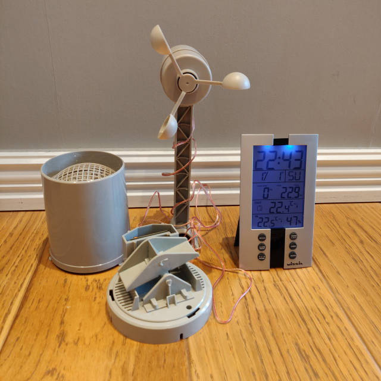

# Missil ML0757

Weather station of unknown origins. A web search yields
[this](https://www.hktdc.com/suppliers-products/Digital-Weather-Station-Clock/en/1X00K7TM/258331/),
which is similar, but not the same. See photo:

Sampled weather station does not have a vane for measuring wind direction. The
provided user manual does not provide any details about the communications
protocol whatsoever.

LCD fields are, from top to bottom and left to right:

- Current time
- Month (1-12), day (1-31), day of week
- Wind speed (kph or mph), total rainfall (mm or in)
- Temperature sensor channel and transmitter temperature ("outdoor", °C or °F)
- Receiver temperature ("indoor", °C or °F) and receiver humidity (%)

Note that it is only possible to change the channel on the receiver. The
transmitter has no buttons or settings to do this. This seems like a useless
feature. The transmitter always transmits on channel 1.

Flexible decoder example:

    rtl_433 -R 0 -X 'n=weather,m=OOK_PPM,s=975,l=1950,g=2500,r=4500,t=100,bits=40,repeats>=7,match={4}0xf'

The transmitter broadcasts on approx. **433.92 MHz**.
