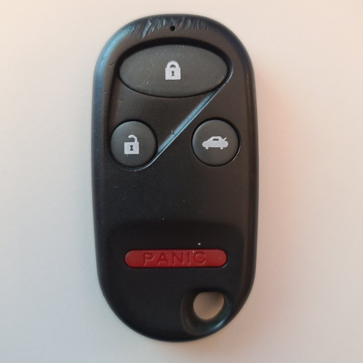
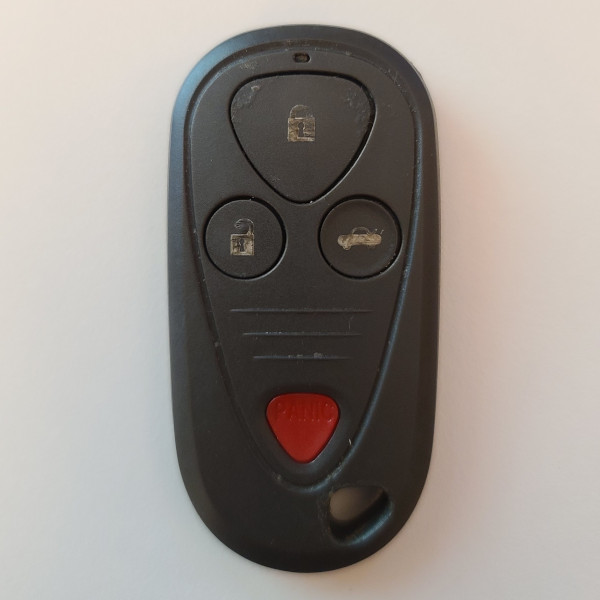

# Nidec - Car Remote (313 MHz)

## Manufacturer
- Nidec

## Supported Models
- OUCG8D-344H-A (OEM for Honda)

## Notes
The transmitter uses a rolling code message.

### Button operation
* The unlock, lock buttons can be pressed once to transmit a single message.
* The trunk, panic buttons will transmit the same code on a short press.
* The trunk, panic buttons will transmit the unique code on a long press.
* The panic button will repeat the panic code as long as it is held.

## Images
* Front - Example 1

  

* Front - Example 2

  