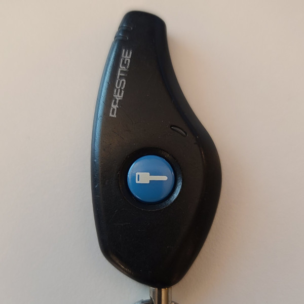
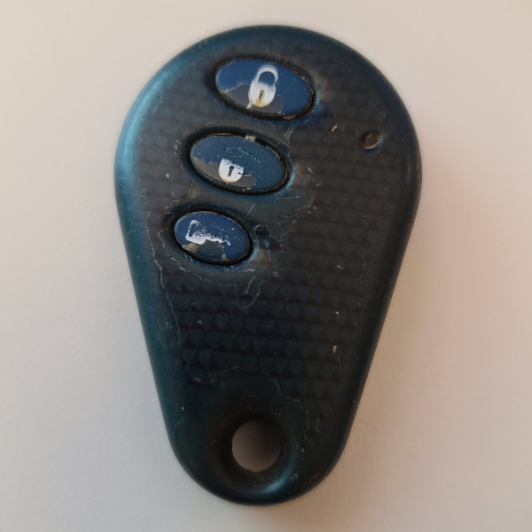
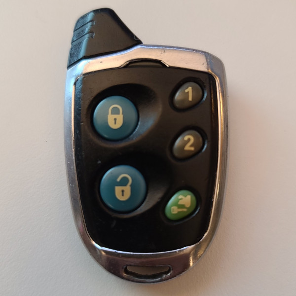
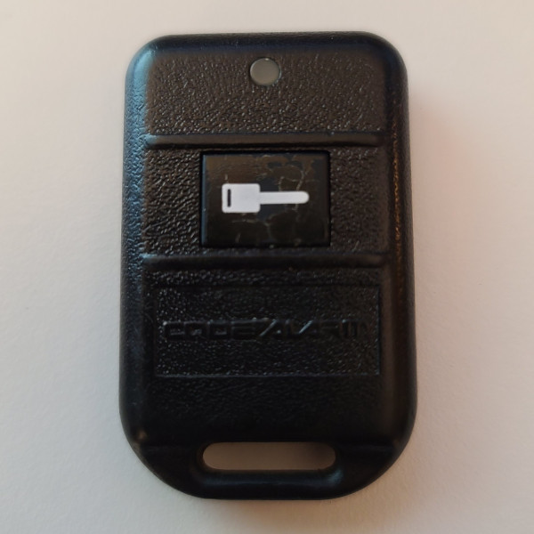

# Nutek - Car Remote

## Manufacturer
- Nutek

## Supported Models
- ATCD-1, APS99BT3BCF4, ATCH (FCC ID ELVATCD)
- AVX1BS4, AVX-1BS4 (FCC ID ELVATCC)
- A1BTX (FCC ID ELVATFE)
- 105BP (FCC ID ELVATJA)

## Notes

Nutek Type 4 and Code Alarm Type 7 Transmitters

Transmitter uses a rolling code that changes between each button press.
The same code is continuously repeated while button is held down.

On some models, multiple buttons can be pressed to set multiple button flags.

## Images
* Front - Example 1

  

* Front - Example 2

  

* Front - Example 3

  

* Front - Example 4

  