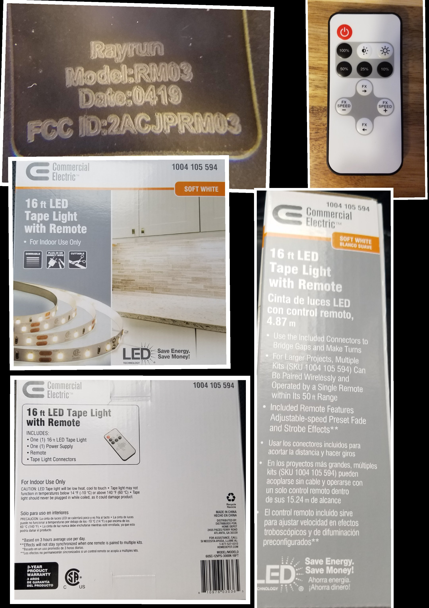

# Rayrun RM03 remote control

## Description

The Rayrun RM03 remote control is a 433.92MHz remote control that controls the dimmable lights in the associated Tape Light kit. This kit can be found at the local hardware store, and is a popular do-it-yourself kitchen lighting solution. The remote control has eleven buttons. The remote control also has a light on the front tip, where an infrared LED might be expected. The light blinks in tandem with button presses, however the remote is actually transmitting on 433.92MHz to the receiver box that controls the lights. The lights are single-color, but can be dimmed up/down (10 levels total) and there are a range of "effects" ("FX") that can be experienced by pressing the FX next/previous buttons.

In order to generate a clean set of cu8 files, I started rtl_433 (`rtl_433 -g 10 -S unknown`) and pressed each button two times, collecting a cu8 file for each keypress. Note that I set the gain to 10 (notably low, to eliminate as much unwanted noise as possible) and held the remote close to the receiver antenna to generate as clear a signal as possible.



## cu8 file manifest

For each button press, two different samples were recorded and the better one picked for this directory and described in detail below. Refer to the photo for a look at the remote. It has 11 buttons.

```

POWER
    *** Saving signal to file g020_433.92M_250k.cu8 (110833 samples, 262144 bytes)
    *** Saving signal to file g031_433.92M_250k.cu8 (110834 samples, 262144 bytes)

100%
    *** Saving signal to file g021_433.92M_250k.cu8 (112427 samples, 262144 bytes)

DIM DOWN (1 level, 10 levels total)
    *** Saving signal to file g022_433.92M_250k.cu8 (110865 samples, 262144 bytes)

DIM UP   (1 level)
    *** Saving signal to file g023_433.92M_250k.cu8 (112415 samples, 262144 bytes)

50% BRIGHTNESS
    *** Saving signal to file g024_433.92M_250k.cu8 (112447 samples, 262144 bytes)

25% BRIGHTNESS
    *** Saving signal to file g036_433.92M_250k.cu8 (114069 samples, 262144 bytes)

10% BRIGHTNESS
    *** Saving signal to file g026_433.92M_250k.cu8 (133335 samples, 393216 bytes)

FX FORWARD (Next Lighting Effect)
    *** Saving signal to file g027_433.92M_250k.cu8 (112371 samples, 262144 bytes)

FX BACK (Previous Lighting Effect)
    *** Saving signal to file g028_433.92M_250k.cu8 (113953 samples, 262144 bytes)

FX SPEED UP (Speeds up blinking)
    *** Saving signal to file g029_433.92M_250k.cu8 (133411 samples, 393216 bytes)

FX SPEED DOWN (Slows down blinking)
    *** Saving signal to file g030_433.92M_250k.cu8 (112389 samples, 262144 bytes)

```

## Decode

With
```
rtl_433 -X 'n=Rayrun,m=OOK_PPM,s=500,l=1500,g=2000,r=4500'
```

- rayrun_rm03/01/g020_433.92M_250k.cu8  {0}, {40}3313 012196
- rayrun_rm03/01/g031_433.92M_250k.cu8  {0}, {40}3313 0121f0
- rayrun_rm03/01/g021_433.92M_250k.cu8  {0}, {40}3313 0323f0
- rayrun_rm03/01/g022_433.92M_250k.cu8  {0}, {40}3313 0424f0
- rayrun_rm03/01/g023_433.92M_250k.cu8  {0}, {40}3313 0525f0
- rayrun_rm03/01/g024_433.92M_250k.cu8  {0}, {40}3313 0626f0
- rayrun_rm03/01/g036_433.92M_250k.cu8  {0}, {40}3313 0727f0
- rayrun_rm03/01/g026_433.92M_250k.cu8  {0}, {40}3313 0828f0
- rayrun_rm03/01/g027_433.92M_250k.cu8  {0}, {40}3313 0a2af0
- rayrun_rm03/01/g030_433.92M_250k.cu8  {0}, {40}3313 0c2cf0
- rayrun_rm03/01/g028_433.92M_250k.cu8  {0}, {40}3313 0e2ef0
- rayrun_rm03/01/g029_433.92M_250k.cu8  {0}, {40}3313 1030f0
