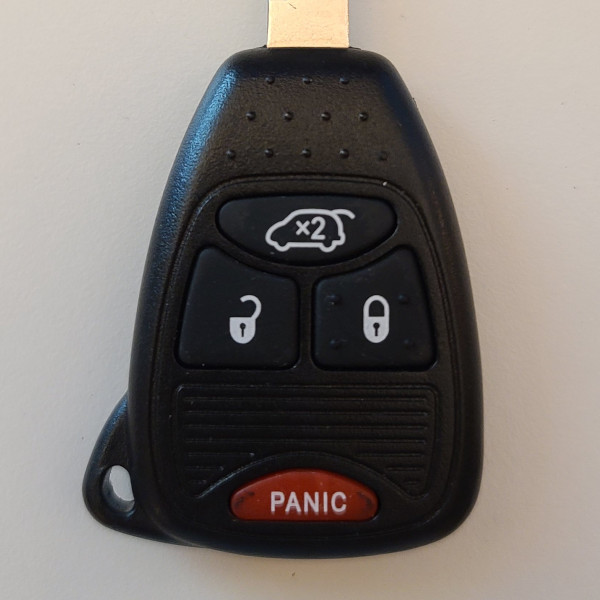

# Siemens - Car Remote (315 MHz)

## Manufacturer
- Siemens

## Supported Models
- 5WY72XX, (FCC ID M3N5WY72XX) (OEM for DaimlerChrysler SKREEK CS and RS vehicle platforms.)

## Notes

The transmitter uses a rolling code message with an unencrypted sequence number.

### Button operation
This transmitter has up to 6 buttons which can be pressed once to transmit a single message.
Multiple buttons can be pressed to send unique codes.

## Images
* Front

  