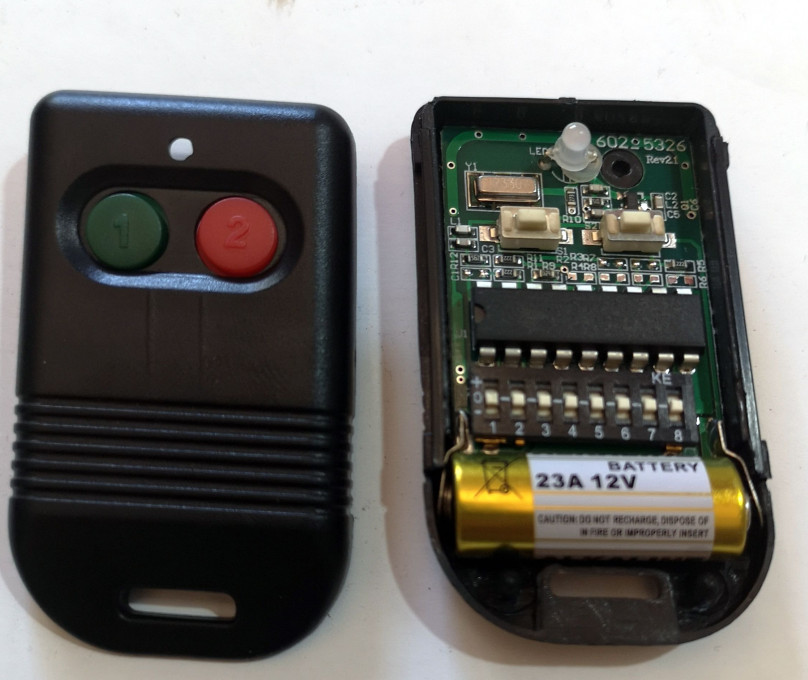
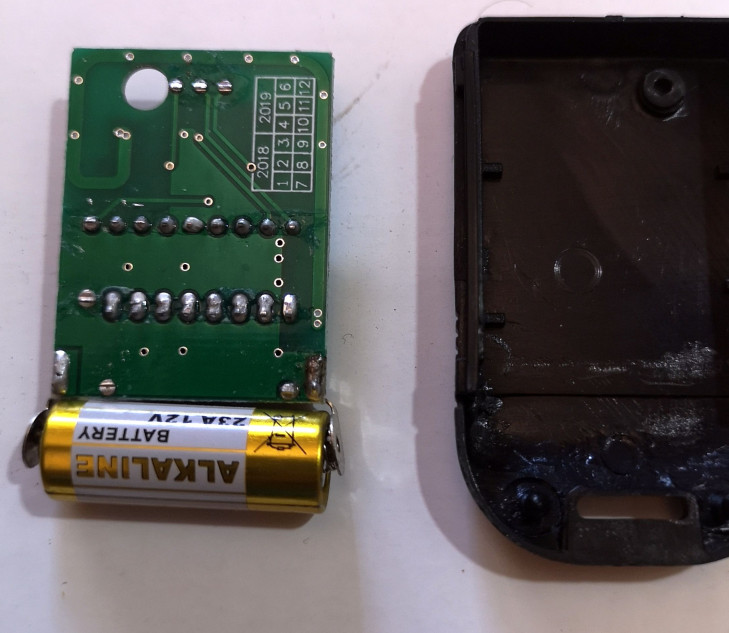

# SMC5326 remote controller with 2 or 4 control button

This is a remote controller decoder chip available from [Smartchip](http://www.smartchip.com.tw/IC_5326.html).
Usually configured with an 8 DIP switch (See captured [images](#Images).

This decoder reads button pressed from a the remote control. The four or two rubber buttons are directly
connected to the SMC5326 code pins. ressing more than one button at the same time is possible.

## Technical Description
1. The device uses PWM encoding with 26-bits per packets
	* 0 is encoded as 328 us pulse
	* 1 is encoded as 948 us pulse
2. A transmission ends with a sync of 0xC, if there are repeated packets, each has a 5000 us gap.
3. Data layout: KKKK KKKK BBBB SS
	* K: 2-bit keys (0x3 is +, 0x2 is f and 0x0 is -)
	* B: 2-bit button (0x2 is default)
	* S: 2-bit sync (0xc is default)

## Captured data
File | Code | Button
-----|------|-------
01/g001_330M_250k.cu8 | ++++++++ | A
01/g002_330M_250k.cu8 | ++++++++ | B
01/g003_330M_250k.cu8 | -------- | A
01/g004_330M_250k.cu8 | -------- | B
01/g005_330M_250k.cu8 | ffffffff | A
01/g006_330M_250k.cu8 | ffffffff | B

## Images

