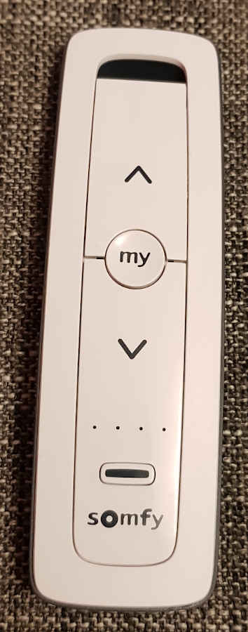
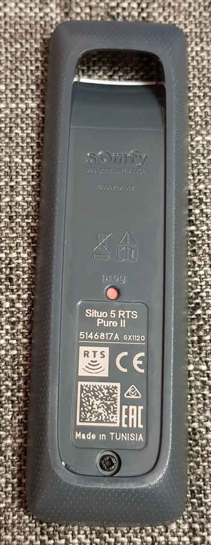

# Situo 5 RTS Pure II

Its a remote control which can control up to five different devices. To this end, a different address is assigned to each channel.

More information about the device can be found here:
- https://www.somfysystems.com/en-us/products/1800139/situo-rts (English)
- https://asset.somfy.com/Document/b76dc1b8-d1af-49a3-aa8f-3fe0742f57fd_Situo_RTS_Spec_Sheet_10.16.18.pdf (English)
- https://shop.somfy.de//situo-5-rts-pure-ii.html (German)

Here is a picture of the device's front:

Here is a picture of the device's back:
