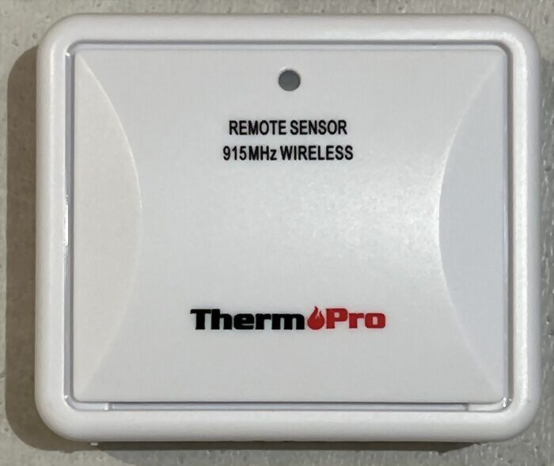
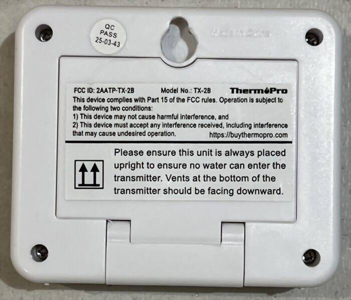
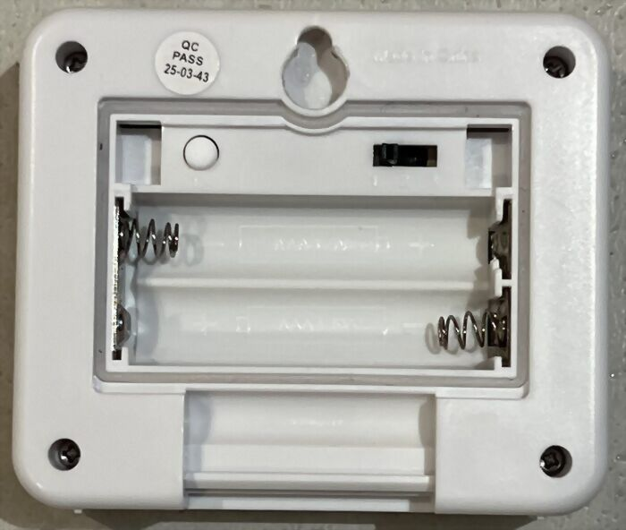

# ThermoPro TX-2B Outdoor Thermometer and Humidity Sensor

915 MHz (North America ISM band) variant of the ThermoPro TX-2C, sold in
North America with ThermoPro console displays. Decoded by the
`thermopro_tx2c` decoder (protocol 245, default-disabled) — the TX-2B is
protocol-identical to the TX-2C.

The back label carries `FCC ID: 2AATP-TX-2B` and `Model No.: TX-2B`, which
identifies the hardware these samples came from. `inside.jpg` shows the
battery compartment with the TX button and the 1/2/3 channel slide switch
that set the `button` and `channel` fields.

Manufacturer page: <https://temppro.com/products/tx2b> (the ThermoPro
brand is now TempPro; the old buythermopro.com product URL redirects
there). Stated specifications: 915 MHz, -20 to 70 C (+/-2 F), 10 to 99 %
RH (+/-2-3 %), 2x AAA, up to four sensors per base station. The 10 % RH
lower bound matches the humidity floor seen in the freezer sample below.

Captured 2026-07-14 and 2026-08-30 with `rtl_433 -f 915M -s 250k`
(RTL-SDR, Nooelec NESDR SMArt v5). Five units owned by the submitter
appear across the samples and the additional codes below; the id is
randomized each time a sensor powers up, so the same physical unit appears
under different ids once its battery has been changed.

## Signal

OOK PPM, fixed 452 us pulse, ~1950 us short gap, 3790-3920 us long gap
(the per-unit median runs 3788-3832 us), ~8560 us packet gap. A
transmission is nine rows: one 7-bit lead-in row (5 bits in the id 70
capture), seven 45-bit repeats, and one truncated 36-bit row. Marginal
leading and trailing edges occasionally merge two rows, so some captures
carry a 47- or 63-bit row in place of the first repeat, or a 51-bit row in
place of the trailing one.

The long gap of some units — e.g. id 70 in
`tx2b_id70_long_gap_915M_250k.cu8` — sits above the `gap_limit` of 3829 us
that `thermopro_tx2c` used before TX-2B support was added. That limit fell
inside the long-gap jitter and shattered those units' transmissions into
fragment rows. The decoder change that adds the TX-2B widens it to 7000 us,
still well clear of the 8550 us packet gap.

Three of the samples here — `tx2b_id70_long_gap`,
`tx2b_ch_3_freezer_negative` and `tx2b_ch_3_freezer_humidity_floor` —
produce no output at all with the old 3829 us limit, so this fixture set
requires the paired rtl_433 decoder change and cannot pass without it. The
existing `tests/thermopro-tx2c` and `tests/thermopro-tx2` fixtures are
unaffected by the wider limit.

## Samples

| File | id | ch | temp C | humidity | button |
|------|----|----|--------|----------|--------|
| tx2b_ch_3_tx_button_915M_250k.cu8 | 109 | 3 | 20.1 | 59 | 1 |
| tx2b_ch_3_freezer_negative_915M_250k.cu8 | 109 | 3 | -14.3 | 15 | 0 |
| tx2b_ch_3_freezer_humidity_floor_915M_250k.cu8 | 109 | 3 | -14.7 | (suppressed) | 0 |
| tx2b_id70_long_gap_915M_250k.cu8 | 70 | 2 | 18.5 | 53 | 0 |
| tx2b_ch_1_fresh_battery_915M_250k.cu8 | 156 | 1 | 20.4 | 64 | 0 |
| tx2b_ch_1_tx_button_915M_250k.cu8 | 156 | 1 | 20.2 | 63 | 1 |

The two `tx_button` samples were recorded while pressing the TX button on the
sensor, which sets the button flag on an otherwise ordinary transmission. The
channel 1 pair is a controlled one: `tx2b_ch_1_fresh_battery` (button 0) and
`tx2b_ch_1_tx_button` (button 1) are the same physical unit minutes apart in
one session, so they differ in the button flag and nothing else of substance.
The three channel 3 samples are that same physical unit before its battery
was changed: it was on channel 3 and had powered up as id 109, and the
battery change moved it to id 156. So five of the six samples come from one
sensor under two ids, and `tx2b_id70_long_gap` is the only one from a
different unit.

The freezer samples were recorded with the id 109 sensor placed in a
household freezer, and exercise the signed 12-bit temperature field. The
sensor's paired console display stabilized at -14.5 C, matching the decoded
plateau values (-14.1 to -14.7 C), and an IR thermometer aimed at the sensor
case read about -12 C (the freezer air deeper inside was colder). In the
`humidity_floor` sample the humidity reading is pinned at its 10 % floor
(0x0A), which the decoder suppresses because 433 MHz units without a
humidity sensor send 0x0A as filler.

The two channel 1 samples exercise `battery_ok: 1`; every other sample
reports `battery_ok: 0`. That is genuine rather than a decode artifact, and
the two states were captured from the same physical sensor. On 2026-08-30 a
fresh cell was fitted to the channel 1 unit and it began reporting
`battery_ok: 1` (as id 156, the two samples above) while the four
untouched units continued to report `battery_ok: 0`; the same unit had
been reporting `battery_ok: 0` as id 109 minutes earlier, on its old
cells. So flags bit 3 carries the documented low-battery meaning on the
TX-2B, matching the TX-2C protocol notes in the decoder.

## Additional transmissions

`codes_test.txt` holds one 36-bit row from each of four further captures
that are not shipped as `.cu8` files, covering three more units and a
higher humidity reading. The decoder requires four repeated rows
(`bitbuffer_find_repeated_row(bitbuffer, 4, 36)`), so `repeat` is set to 4.
