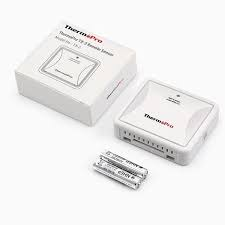

# ThermoPro TX2C Remote Sensor

The ThermoPro TX2C Remote Sensor is sold with various ThermoPro thermometer/hygrometer devices (TP200C, TP60C, TP65C) and also as a standalone accessory.

This folder contains the following samples:

- channel1_868M_1000k.cu8 : Channel=1; Temperature=21.1
- channel2_868M_1000k.cu8 : Channel=2; Temperature=21.3

Note: Pressing the reset button on the TX2C causes it to generate a new id value which is included in the next transmission.

[Bitbench link](https://triq.net/bitbench#c=%5Bpre-existing%20example%5D%2095%2000%20ff%20e0%20a0%2000&c=%5Bwith-button%5D%2093440db38000&c=&c=%5Bchan1%5D%2093400df37000&c=%5Bchan1%2Bbutton%5D%2092640D041000&c=%5Bchan2%5D%2093F10E43D000&c=%5Bhigh%20humidity%5D%2093F00E852000&c=%5Bnormal%20humidity%5D%2093F00D246000&f=FIXED%3Dh%20ID%3Dd%20LOW_BAT%3Db%20BUTTON%3Db%20CHANNEL%3Dbb%20TEMP_C%3Dbbbbd%20HUM%3Dd%25%20ZERO%3Dbbbbbbbbbbbb&cw=4)
