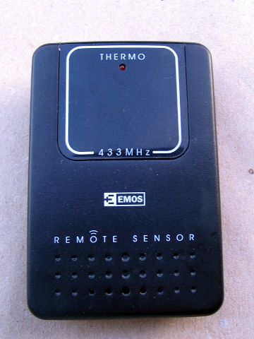
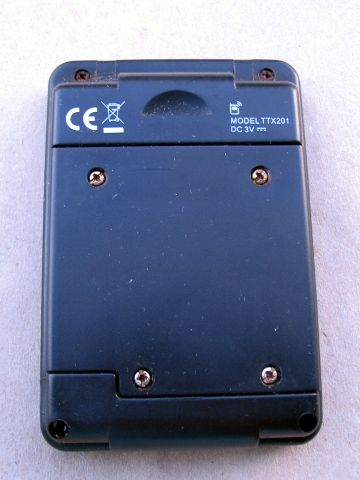

# Emos TTX201 Remote Temperature Sensor
https://shop.emos.cz/2603108000-bezdratovy-teplomer-ttn303 (no English site)

* Manufacturer: Ewig Industries Macao
* Model No.: TTX201
* Maybe same as Ewig TTX201M (FCC ID: N9ZTTX201M)
* Uses 4-bit Microcontroller TM8722
* Measurable range: -20 °C ~ +50 °C
* 2 x 1.5 V AAA/LR4 battery
* Transmit Interval: every ~61s
* Frequency 433.92 MHz
* 5 Channels
* LED is blinking on every TX
* button to select channel, reset button

Manchester Encoding, pulse width: 500 us, interpacket gap width 1500 us.

A complete message is 445 bits:
```
     PPPPPPPP PPPPPPPP P
  LL LLKKKKKK IIIIIIII S???BCCC ?XXXTTTT TTTTTTTT MMMMMMMM JJJJ  (repeated 7 times)
  LL LLKKKKKK IIIIIIII S???BCCC ?XXXTTTT TTTTTTTT MMMMMMMM       (last packet without J)
```

17-bit initial preamble, always 0
```
  PPPPPPPP PPPPPPPP P = 0x00 0x00 0
```

54-bit data packet format
```
  0    1   2    3   4    5   6    7   8    9   10   11  12   13  (nibbles #, aligned to 8-bit values)
  ..LL LLKKKKKK IIIIIIII S???BCCC ?XXXTTTT TTTTTTTT MMMMMMMM JJJJ

  L = 4-bit start of packet, always 0
  K = 6-bit checksum, sum of nibbles 3-12
  I = 8-bit sensor ID
  S = startup (0 = normal operation, 1 = reset or battery changed)
  ? = unknown, always 0
  B = battery status (0 = OK, 1 = low)
  C = 3-bit channel, 0-4
  X = 3-bit packet index, 0-7
  T = 12-bit signed temperature * 10 in Celsius
  M = 8-bit postmark, always 0x14
  J = 4-bit packet separator, always 0xF
```

## Sample data

Received raw data package:
```
bitbuffer:: Number of rows: 10 
[00] {17} 00 00 00             : 00000000 00000000 0
[01] {54} 07 30 80 00 42 05 3c 
[02] {54} 07 70 80 04 42 05 3c 
[03] {54} 07 b0 80 08 42 05 3c 
[04] {54} 07 f0 80 0c 42 05 3c 
[05] {54} 08 30 80 10 42 05 3c 
[06] {54} 08 70 80 14 42 05 3c 
[07] {54} 08 b0 80 18 42 05 3c 
[08] {50} 08 f0 80 1c 42 05 00 : 00001000 11110000 10000000 00011100 01000010 00000101 00
[09] { 1} 00                   : 0
```

Decoded:
```
 r  cs    K   ID    S   B  C  X    T    M     J
 1  28    28  194  0x0  0  0  0   264  0x14  0xf
 2  29    29  194  0x0  0  0  1   264  0x14  0xf
 3  30    30  194  0x0  0  0  2   264  0x14  0xf
 4  31    31  194  0x0  0  0  3   264  0x14  0xf
 5  32    32  194  0x0  0  0  4   264  0x14  0xf
 6  33    33  194  0x0  0  0  5   264  0x14  0xf
 7  34    34  194  0x0  0  0  6   264  0x14  0xf
 8  35    35  194  0x0  0  0  7   264  0x14
```

```
Analyzing pulses...
Total count:  373,  width: 110415		(441.7 ms)
Pulse width distribution:
 [ 0] count:  302,  width:   115 [113;122]	( 460 us)
 [ 1] count:   71,  width:   237 [234;240]	( 948 us)
Gap width distribution:
 [ 0] count:  292,  width:   128 [126;133]	( 512 us)
 [ 1] count:    8,  width:   377 [376;381]	(1508 us)
 [ 2] count:   72,  width:   251 [248;253]	(1004 us)
Pulse period distribution:
 [ 0] count:  271,  width:   244 [241;252]	( 976 us)
 [ 1] count:   58,  width:   489 [485;497]	(1956 us)
 [ 2] count:   43,  width:   366 [364;368]	(1464 us)
Level estimates [high, low]:  14140,    126
Frequency offsets [F1, F2]:  -18457,      0	(-70.4 kHz, +0.0 kHz)
```




