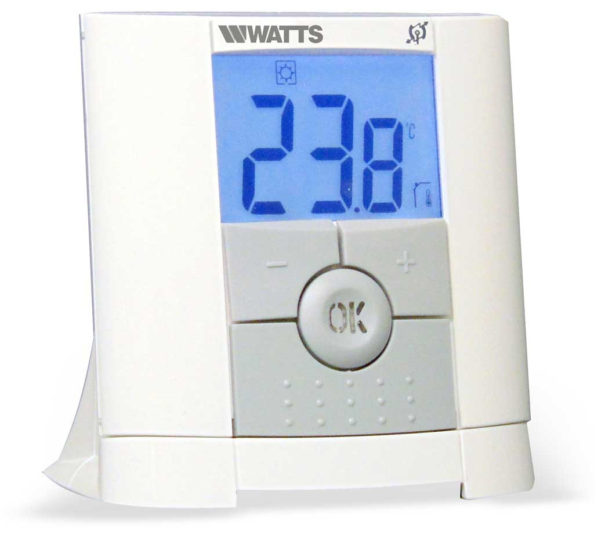

# Watts Vision thermostat (-f 868.3M)

Watts Vision BT-D03-RF wireless thermostat system: a base/central unit
(source `d0904d89` in all known captures) exchanging FSK packets with
per-room endpoints (`d037....`), on a TI CC110L transceiver at 868.3 MHz.

See https://github.com/merbanan/rtl_433/issues/2885.

Packet layout (all byte-aligned, after the CC110L preamble + repeated
`d391` sync word):

    LEN:8h ID:32h MARKER:8h DEST:32h RECORDS:(LEN-11)*8h CRC_MDB:16h CRC_CMS:16h

- `CRC_MDB`: CRC-16/MODBUS (poly 0x8005 reflected = 0xa001, init 0xffff),
  little-endian, application-generated.
- `CRC_CMS`: CRC-16/CMS (poly 0x8005, init 0xffff, not reflected),
  big-endian -- the CC110L's own hardware packet CRC.

`RECORDS` is a generic 1-byte-tag + value record stream, not a layout
fixed per message length: the value length is encoded in the tag's own
top two bits, `value_length = (tag >> 6) + 1` (1-4 bytes). A tag byte of
`0x00` ends the stream early. Two message lengths/directions are known:

- Short (`LEN` = 0x14): base -> endpoint command/state. `0x03`: a
  per-endpoint association/slot id (`association_id`). `0xdf`: four
  packed state bytes (`state_raw`, hex, undecoded). `0x3b`: a status
  byte (`flags_raw`), always zero in every known capture.
- Long (`LEN` = 0x22): endpoint -> base status report.
  - `0x4b`: measured temperature (`temperature_F`), big-endian tenths of
    a degree Fahrenheit, reported as-is (the wire's native unit).
  - `0x5e`: a secondary floor/external temperature (`temperature_2_F`,
    same scale); not present in any currently known capture.
  - `0x8a`: a mode-specific setpoint (`mode_setpoint_F`, same scale) plus
    a one-byte mode enum (`setpoint_mode`: Comfort/Off/Anti-freeze/
    Reduced-ECO/Boost-Timer/Auto-phase/Manual-Temporary).
  - For `0x4b`/`0x5e`/`0x8a`, a raw value of `0x084c` is a documented
    "sensor unavailable" sentinel; the corresponding field is omitted
    rather than reported as a bogus 212.4 F reading.
  - `0x8e`: installer-configured setpoint range as plain integer Celsius
    (`setpoint_min_C`/`setpoint_max_C`), plus a regulation-source
    selector (`sensor_mode`: Amb/FLR/FLL/Air) and its raw byte
    (`sensor_flags_raw`, upper bits undecoded).
  - `0xcc`: two floor-temperature limits (`floor_limit_1_F`/
    `floor_limit_2_F`), only meaningful in FLL sensor mode; a zero word
    means unavailable and is omitted (always the case in every known
    capture, so order is unconfirmed).
  - `0x4c`: a diagnostic code and warning-flags byte (`diagnostic_code`/
    `diagnostic_flags`); individual warning bits not yet confirmed.
  - `0x8d`: packed report/update state (`report_flags_0/1/2`); bit 0 of
    `report_flags_1` is known to gate whether the paired `0x8a` value is
    a setpoint update vs. an informational snapshot.

Directory contents:

- `watts_vision_cc110l_analysis.md` -- the full protocol investigation
  writeup this decoder is based on: physical/CC110L layer identification,
  both CRCs, the record grammar, and per-tag findings and confidence
  levels.
- `watts_vision_bt-d03-rf.jpg` -- the device photo attached to the issue.
- `01/` -- three real `.cu8` captures of short/command messages (source
  `d0904d89`). These need `-Y minmax`; the default FSK pulse detector mode
  does not recover any messages from them (see `01/ignore`), so this
  subdirectory is excluded from the automated regression harness --
  verify manually with `-Y minmax`.
- `codes_test.txt` / `codes_test.json` -- two long/status messages
  hand-transcribed from the linked issue thread (no `.cu8` captures were
  available for these), covering the `4b`/`8a` temperature and setpoint
  fields. Not wired into the automated runner; verify by hand per the
  `rtl_433_tests` root `AGENTS.md`/README convention.
