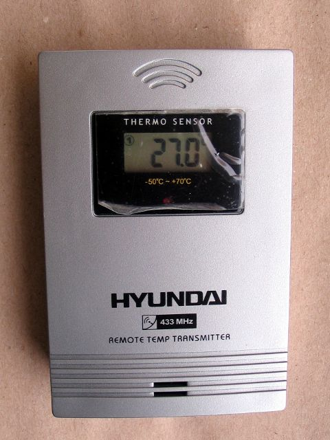
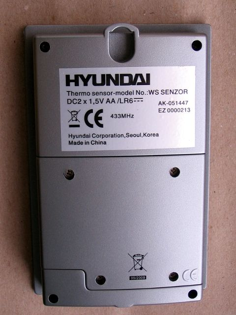

# Hyundai WS SENZOR Remote Temperature Sensor for weather stations

https://www.hyundai-electronics.cz/cidlo-pro-meteostanice-hyundai-ws-senzor-stribrne/z68589/ (no English site)

* Manufacturer: Hyundai Corporation, Seoul, Korea
* Model No.: WS SENZOR
* Measurable range: -50 °C ~ +70 °C
* 2 x 1.5 V AA/LR6 battery
* Transmit Interval: every ~33s
* Frequency 433.92 MHz
* 3 Channels
* LED is blinking on every TX
* button to select temperature units °C/°F, TX-button (force send)
* External temperature sensor probe

Distance coding: Pulse length 224 us  
Short distance: 1032 us, long distance: 1992 us, packet distance: 4016 us

24-bit data packet format, repeated 23 times  
  TTTTTTTT TTTTBSCC IIIIIIII  

  T = signed temperature * 10 in Celsius  
  B = battery status (0 = low, 1 = OK)  
  S = startup (0 = normal operation, 1 = battery inserted or TX button pressed)  
  C = channel (0-2)  
  I = sensor ID  

## Sample data:
```
[01] {24} ff f8 8a  : 11111111 11111000 10001010

Sensor ID	= 138 = 0x8a
Bitstream HEX	= ff f8 8a
Battery OK	= 1
Startup		= 0
Channel		= 1
temp		= -1 = 0xffffffff
TemperatureC	= -0.1
```

```
Analyzing pulses...
Total count:  575,  width: 236925		(947.7 ms)
Pulse width distribution:
 [ 0] count:  575,  width:    56 [53;65]	( 224 us)
Gap width distribution:
 [ 0] count:  390,  width:   258 [252;289]	(1032 us)
 [ 1] count:  161,  width:   498 [497;533]	(1992 us)
 [ 2] count:   23,  width:  1004 [1003;1005]	(4016 us)
Pulse period distribution:
 [ 0] count:  390,  width:   315 [311;346]	(1260 us)
 [ 1] count:  161,  width:   556 [554;591]	(2224 us)
 [ 2] count:   23,  width:  1061 [1060;1063]	(4244 us)
Level estimates [high, low]:  15905,    100
Frequency offsets [F1, F2]:  -10073,      0	(-38.4 kHz, +0.0 kHz)
```



